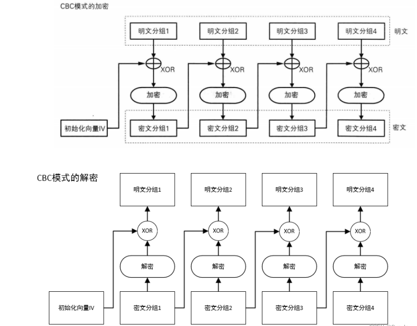

# 实验2：编程实现DES的CBC模式


### 学号：2112066

### 姓名：于成俊

### 专业：密码科学与技术


## 一、实验环境

- 系统：Ubuntu
- 语言：C


## 二、实验过程

- 首先要了解DES的CBC模式：



- 在进行解密之前，我们需要检测初始向量和密钥是否满足规定的格式，所以编写如下代码

```c
//检测字符是否是十六进制数字
int isAlnum(char c) {
    return (c >= '0' && c <= '9') || (c >= 'a' && c <= 'f') ;
}

    int iv_length = strlen(argv[1]);
    int key_length = strlen(argv[2]);
    //检测初始向量和密钥的长度
    if(iv_length!=16){
	printf("Length of iv is not valid! \n");
	return 1;
    }
    if(key_length!=16){
	printf("Length of key is not valid! \n");
	return 1;
    }
    //检测初始向量和密钥的字符
    {
    
    char* iv = argv[1];
    int i = 0;
    while (++i<=16) {
        if (!isAlnum(*iv)) {
            printf("The characters of iv are not valid! \n");
            return 1; // 如果不是字母或数字，返回1
        }
        iv++;
    }
    i=0;
    char* key = argv[2];
    while (++i<=16) {
        if (!isAlnum(*key)) {
            printf("The characters of key are not valid! \n");
            return 1; // 如果不是字母或数字，返回1
        }
        key++;
    }

    }
```

- 我们需要将将字符串形式的密钥转换为DES_cblock类型的密钥

```C
// 定义DES密钥和密钥调度表
DES_cblock key;
DES_key_schedule schedule;
// 将字符串形式的密钥转换为DES_cblock类型的密钥
memcpy(&key, argv[2], 8);
// 使用DES_set_key_unchecked函数设置密钥
DES_set_key_unchecked(&key, &schedule);
```

在这里我没有使用`DES_set_key_checked()`函数来设置密钥，因为在进行实验的过程中，发现使用`DES_set_key_checked()`函数会导致每次加密结果不一致，所以采用`DES_set_key_unchecked()`函数

- 然后，我们要将输入文件的内容转为16进制的形式：

```C
//将文件内容转化为16进制格式
    {
    
    FILE *hex_file;
    char buffer[16]; // 缓冲区大小，每次最多读取16个字节
    size_t bytes_read;
    hex_file = fopen("hex_output.txt", "w"); // 以文本写入方式打开文件

    // 检查输出文件是否成功打开
    if (hex_file == NULL) {
        printf("无法创建文件 %s\n", "hex_output.txt");
        return 1;
    }
    // 逐块读取文件内容并以十六进制格式写入输出文件
    while ((bytes_read = fread(buffer, 1, sizeof(buffer), input)) > 0) {
        for (size_t i = 0; i < bytes_read; ++i) {
            fprintf(hex_file, "%02X", buffer[i]); // 以十六进制格式写入每个字节的内容
        }
    }
    // 关闭文件
    fclose(hex_file);
    
    }
```

- 根据DES的CBC模式图，编写加密代码。注意，不满足16个字节时，要用0补齐：

```C
while (fgets(buffer, sizeof(buffer), hex_file)){
	        
	     //不满16则用0补齐
		if(strlen(buffer)<16){
		    for(int i=strlen(buffer);i<16;i++){
			   buffer[i]='0';
		    }
			buffer[16]='\0';
			Plaintext_block = strtoull(buffer,NULL,16);//明文
			temp_64 = Plaintext_block^Ciphertext_block;
			//转化为uint32_t类型
			temp_32[0] = (uint32_t)(temp_64 >> 32); //取高32位
			temp_32[1] = (uint32_t)(temp_64  & 0xFFFFFFFF); //取低32位
			//DES加密
			 DES_encrypt1(temp_32,&schedule,operation);
			 Ciphertext_block = ((uint64_t)temp_32[0] << 32) | (uint64_t)temp_32[1]; 
			 fprintf(output,"%016" PRIx64,Ciphertext_block);
		     break;
		    }
		    
		if(first){
		    first = false;
		    Plaintext_block = strtoull(buffer,NULL,16); //明文
		    temp_64 = Plaintext_block^iv_64;
		    //转化为uint32_t类型
		    temp_32[0] = (uint32_t)(temp_64 >> 32); //取高32位
		    temp_32[1] = (uint32_t)(temp_64  & 0xFFFFFFFF); //取低32位
		    //DES加密
		    DES_encrypt1(temp_32,&schedule,operation);
		    Ciphertext_block = ((uint64_t)temp_32[0] << 32) | (uint64_t)temp_32[1]; 
		    fprintf(output,"%016" PRIx64,Ciphertext_block);
		}  
		else{
		    Plaintext_block = strtoull(buffer,NULL,16); //明文
		    temp_64 = Plaintext_block^Ciphertext_block;
		    //转化为uint32_t类型
		    temp_32[0] = (uint32_t)(temp_64 >> 32); //取高32位
		    temp_32[1] = (uint32_t)(temp_64  & 0xFFFFFFFF); //取低32位
		    //DES加密
		    DES_encrypt1(temp_32,&schedule,operation);
		    Ciphertext_block = ((uint64_t)temp_32[0] << 32) | (uint64_t)temp_32[1]; 
		    fprintf(output,"%016" PRIx64,Ciphertext_block);
		}
}
```

- 再根据DES的CBC模式图，编写解密代码。不满足16个字节时，也要用0补齐：

```C
// 每次读取十六个字符
while (fgets(buffer, sizeof(buffer), hex_file)){
	    //不满16则用0补齐
	    if(strlen(buffer)<16){
	       for(int i=strlen(buffer);i<16;i++){
		buffer[i]='0';
	       }
		    buffer[16]='\0';
		    Ciphertext_block = strtoull(buffer,NULL,16);//密文
		    //转化为uint32_t类型
		    temp_32[0] = (uint32_t)(Ciphertext_block >> 32); //取高32位
		    temp_32[1] = (uint32_t)(Ciphertext_block  & 0xFFFFFFFF); //取低32位
		    //DES解密
		    DES_encrypt1(temp_32,&schedule,operation);
		    temp_64 = ((uint64_t)temp_32[0] << 32) | (uint64_t)temp_32[1]; 
		    Plaintext_block = temp_64^last;
		    fprintf(output,"%016" PRIx64,Plaintext_block);
            break;
	    }

		if(first){
		    first = false;
		    Ciphertext_block = strtoull(buffer,NULL,16);//密文
		    
		    //转化为uint32_t类型
		    temp_32[0] = (uint32_t)(Ciphertext_block >> 32); //取高32位
		    temp_32[1] = (uint32_t)(Ciphertext_block  & 0xFFFFFFFF); //取低32位
		    //DES解密
		    DES_encrypt1(temp_32,&schedule,operation);
		    temp_64 = ((uint64_t)temp_32[0] << 32) | (uint64_t)temp_32[1]; 
		    Plaintext_block = temp_64^iv_64; 
		    fprintf(output,"%016" PRIx64,Plaintext_block);
		    last = Ciphertext_block;
		}  
		else{

		    Ciphertext_block = strtoull(buffer,NULL,16);//密文  
		    //转化为uint32_t类型
		    temp_32[0] = (uint32_t)(Ciphertext_block >> 32); //取高32位
		    temp_32[1] = (uint32_t)(Ciphertext_block  & 0xFFFFFFFF); //取低32位
		    //DES解密
		    DES_encrypt1(temp_32,&schedule,operation);
		    temp_64 = ((uint64_t)temp_32[0] << 32) | (uint64_t)temp_32[1]; 
		    Plaintext_block = temp_64^last;
		    fprintf(output,"%016" PRIx64,Plaintext_block);
		    last = Ciphertext_block;
		}
	    }
```


## 三、实验结果

- 使用命令`gcc -o tempdes tempdes.c -lcrypto`进行编译
- 使用命令`./tempdes  fedcba9876543210 40fedf386da13d57 ciphertext.des output.txt decrypt`进行解密，会将ciphertext.des文件中的内容进行解密，然后将结果输出到output.txt文件
- 使用命令`./tempdes  fedcba9876543210 40fedf386da13d57 plaintext.txt output.txt encrypt`进行加密，会将plaintext.txt文件中的内容进行加密，然后将结果输出到output.txt文件
- 当初始向量和密钥长度不等于16时，会进行报错，如下：


- 当初始向量和密钥不满足16进制数字格式时，也会进行报错，如下：


- 进行加密时，原始的AAAAAAAAAAAAAAAAAAAAAAAAAAAAAAAAAAAAAAAAAAAAAAAAAAAAAAAAAAAAAAAA，先转化为16进制格式，即41414141414141414141414141414141414141414141414141414141414141414141414141414141414141414141414141414141414141414141414141414141，然后进行加密，结果为7d94c3576dea14e632dfb63a4260aa8e9ec69e87bccde694b56ce8548901a8fbffcca6b9746abf6f05f338db3d48024ca406a12059a37b1415b4b4760dccdc67

- 进行解密时，原始的乱码，先转化为16进制格式，即3F2B41FFFFFFE8FFFFFFB5FFFFFF9A543F6C21FFFFFFE7FFFFFFBCFFFFFFA60E357D1A6DFFFFFFE9FFFFFF87FFFFFFB7FFFFFFE4FFFFFFBFFFFFFF904341FFFFFFE6FFFFFFB3FFFFFF823EFFFFFFE7FFFFFFA5FFFFFFBEFFFFFFE7FFFFFF9FFFFFFFACFFFFFFE5FFFFFF9EFFFFFFAB7B4CFFFFFFEFFFFFFFA3FFFFFFB5FFFFFFE7FFFFFF96FFFFFFBF1BFFFFFFE8FFFFFFBDFFFFFFA4FFFFFFE8FFFFFFB5FFFFFF851C3FFFFFFFE7FFFFFFA8FFFFFFA23F556426FFFFFFE6FFFFFF98FFFFFF8D203F3FFFFFFFE6FFFFFFBCFFFFFF952A7D3F0D0A，然后进行解密，结果为4cf39f2cf624ffe8d431aecd45de269a4141abdd8d69da8d91b1cbfa58805cfdcf956d98d4e08b3971fbb837f711f487a47c686cc66c52b682586845983f5eeee3e0372ee6fb58fd4b7b8024249f23925dd6135966924c1ee507c892552750ddac6774cfb5de514d4d5e023df395829019fc5da4dc3c27b9cd8cd5c41bdde430f68fd996b9c10d8b62f2fdb940f473a5eeb6fba0d0a588a4edec477784501355013f4be2b65fabb70bbc0867b0a3be5ee9bcc3d4ebe76256a3a843afd4980f63d62e0f01928435b26667309c306257ba4e30be54e99918a2

  注意，在解密的时候，16进制格式的长度为424，而解密后长度为432，是因为不足64字节，要用0补齐的缘故

- 可以看出，示例文件给出的明文和密文对应的16进制格式的长度，相差非常多，所以我认为两者应该不是相对应的，于是我将加密后的16进制数，再解密回去，来测验我的代码是否正确。由于加密后的内容已经是16进制格式了，所以不能再将其当成字符串进行16进制格式转换了，所以需要注释掉相关代码，我将修改后的代码放进了test.c文件中

- 先使用命令`./test  fedcba9876543210 40fedf386da13d57 plaintext.txt output.txt encrypt`产生密文，然后使用命令`./test  fedcba9876543210 40fedf386da13d57 output.txt temp.txt decrypt`将刚才产生的密文，还原回去。还原成功！，在temp.txt文件中出现41414141414141414141414141414141414141414141414141414141414141414141414141414141414141414141414141414141414141414141414141414141，说明代码正确！


## 四、实验总结

- 在编写代码时，有一个细节，就是当8位16进制数高4位全为0时，只会输出低4位的16进制数，为了杜绝这个问题，需要使用格式化输出，如下

  - `fprintf(hex_file, "%02X", buffer[i]);`
  - `fprintf(output,"%016" PRIx64,Ciphertext_block);`

  控制宽度，不足用0补齐

- 在示例代码中，DES相关函数的函数名中，des都是小写，编译不过去，需要全改成大写，如`des_encrypt1()`需要改为`DES_encrypt1()`


