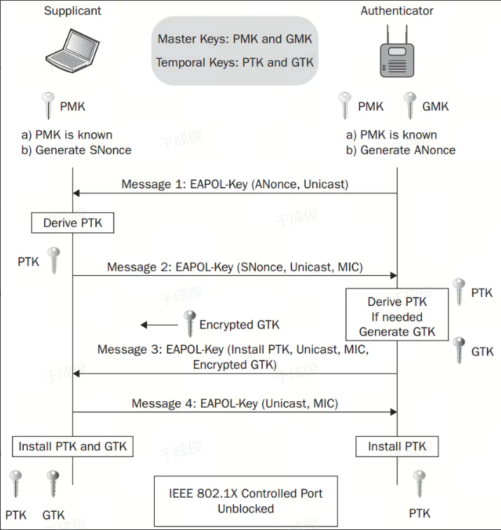
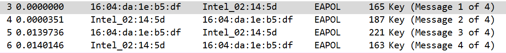
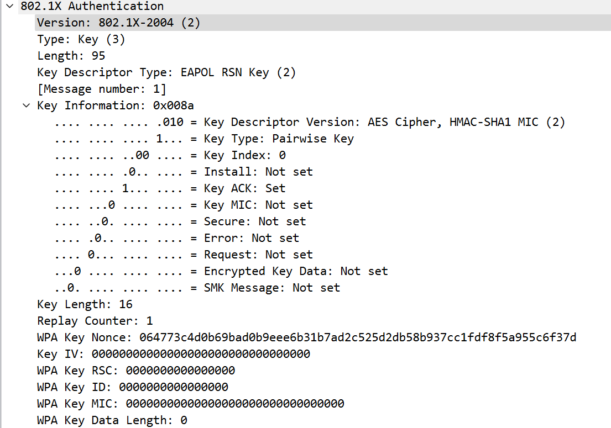
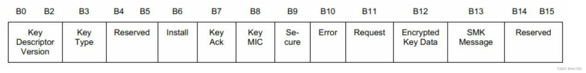
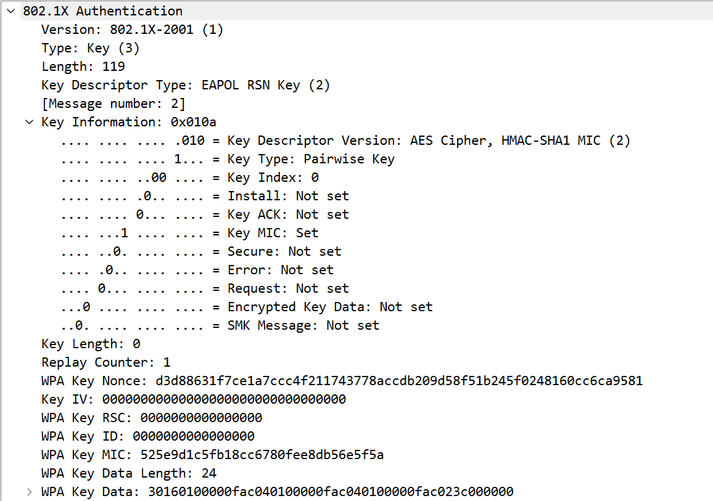
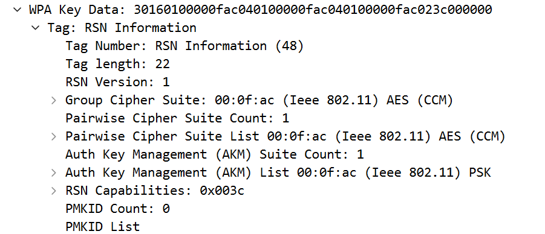
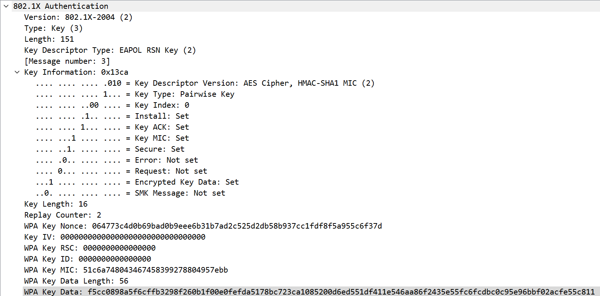
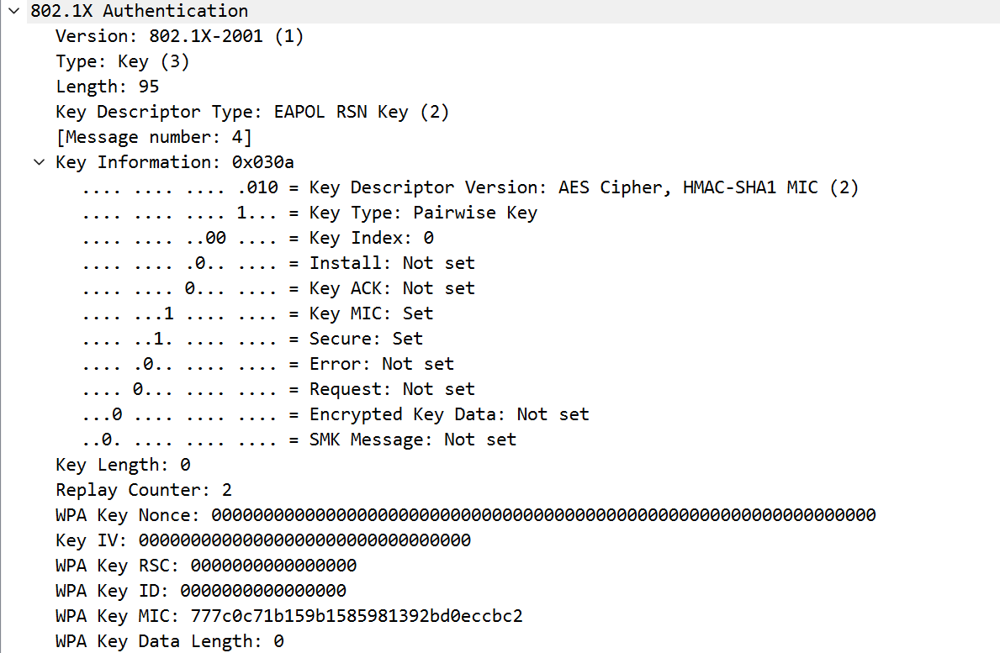
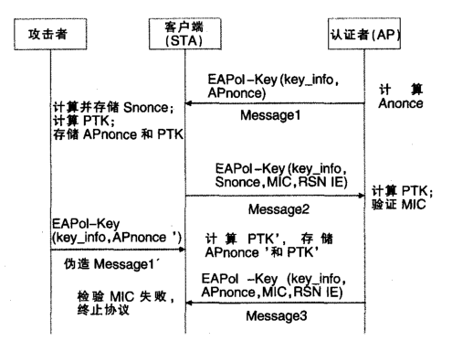
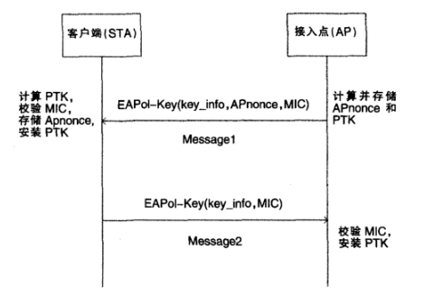

<h1 align = "center">密码学课程第三次实验报告</h1>

<h1 align = "center">实验名称：校园无线身份认证密码协议分析</h1>

### 学号：2112066

### 姓名：于成俊

### 班级：密码班

## 一、实验目的

- 使用抓包软件捕获登录南开大学无线WIFI——**NKU_WLAN**的过程，根据抓包结果对所涉及的身份认证密码协议及其安全性进行分析。

- 抓包工具不限，可以使用Wireshark/Microsoft Network Monitor等。

- 实验环境不限，可基于Linux/Windows等。

## 二、实验内容说明

- 使用抓包软件捕获登录南开大学无线WIFI——**NKU_WLAN**过程中的四次握手数据包，并进行安全性分析。

## 三、实验原理

### （1）协议描述

#### 1.名词解释

- Authenticator：认证者，指AP，即无线接入点
- Supplicant：请求者，指Station，即任何企图接入AP服务集的设备
- ANonce：由AP生成的随机数
- SNonce：由Station生成的随机数
- Mac(AA)：AP的Mac 地址
- Mac(SA)：Station的Mac地址
- PRF：Pseudo-Random Function，表示伪随机函数
- MSK：Master Session Key，主会话密钥
- PMK：Pairwise Master Key，成对主密钥，由MSK生成，用于生成PTK
- GMK：Group Master Key，组主密钥，同样由MSK生成，用于生成 GTK
- PTK：Pairwise Transit Key，成对临时密钥，用来加密 AP 和 Station 通讯的单播数据包，AP与每个Station 通讯用的PTK都是唯一的。PTK的生成函数如下：$PTK=PRF(PMK+ANonce+SNonce+Mac(AA)+Mac(SA))$
- GTK：Group Temporal Key，组临时密钥，用来加密 AP 和 Station 通讯的多播/广播数据包，连接该 AP 的所有 Station 共享一个 GTK。GTK的生成函数如下：$GTK=PRF(GMK+ANonce+Mac(AA))$
- MIC：Message Integrity Check，消息完整性校验码，针对一组需要保护的数据计算出的散列值，用来防止数据遭篡改

#### 2.协议描述

四次握手是 AP（Authenticator）和Station（Supplicant）为了生成一个用于加密无线数据的密钥而进行四次消息交换的过程。协议流程可以参考下图：

- 第一次握手：AP—>Station：ANonce

AP产生随机数Anonce，用EAPOL-KEY帧发送给Station，Station在收到消息后用它生成 PTK，前面已经提到PTK的生成函数：$PTK=PRF(PMK+ANonce+SNonce+Mac(AA)+Mac(SA))$。其中，PTK的前128位是KCK（EAPOL-Key Confirmation Key），用来校验EAPOL-Key帧的完整性。

- 第二次握手：Station—>AP：SNonce，MIC

Station 创建了自己的PTK后，会立即响应一条包含SNonce和MIC的 EAPoL 消息给 AP，AP将进行同样的计算得到PTK， 然后用得到的前128位对EAPoL报文进行完整性校验：比较所得到的值是否和收到报文中的WPA Key MIC的值一致，如果一致，则验证成功，说明Client端（即Station）拥有正确的PMK，否则判定Client端拥有的PMK错误，整个握手就此停止。

- 第三次握手：AP—>Station：MIC，Encryted GTK

验证成功后，AP将 MIC和用PTK加密后的GTK 发送给 Station，并且告知 Station 安装 PTK 和 GTK。Station收到消息后检查MIC，同第二次握手的检查流程一样，如果不一致，将默默丢弃第三个报文，握手就此停止。验证成功后，Station可以使用掌握的PTK进行解密，恢复GTK的值，并安装PTK和GTK。

- 第四次握手：Station—>AP：MIC

Station向AP发送EAPOL-Key消息，确认密钥已经安装，AP 收到该消息后再次检查MIC，验证成功后也安装PTK。安装的意思是指使用PTK 和GTK来对数据进行加密。

### （2）安全性分析

#### 1.数据安全性

协议使用的成对临时密钥PTK包含3个部分，KCK（Key Confirmation Key），KEK（Key Encryption Key），TK（Temporal Key）。其中，KEK和KCK在四次握手中用于数据加密和完整性验证。协议还使用MIC来防止数据遭篡改，保证数据完整性。

#### 2.拒绝服务攻击（DoS）

消息1并没有使用任何加密或完整性校验措施，而且如果AP在规定时间内没有收到客户端发回的应答消息2，就会启动超时装置，重传刚才发送的消息1。因此，客户端会对收到的每一个消息1计算SNonce和PTK。攻击者可以根据这一点伪造消息1，使客户端重新计算PTK，由于前后的Nonce值不一样，因此很容易造成PTK生成的混乱。若攻击者重复这样的攻击过程，那么客户端永远无法与AP完成四次握手过程，更不可能通过AP访问其他合法资源，从而实施DoS攻击。

## 四、实验步骤

- 使用Microsoft Network Monitor 3.4抓取到连接手机热点的四次握手数据包，然后在Wireshark中打开，如下：

  

- 第一次握手（AP—>Station：ANonce）的报文如下图，下面开始进行逐行分析

  

  - 版本：802.1X-2004（2）

  - 帧类型：EAPOL-Key帧

  - 长度：95

  - Key Descriptor Type的值有三种，分别为RC4、RSN和WPA。这里的值为2，表示EAPOL RSN Key，它以下的内容就是Descriptor Body的内容，来描述EAPOL-Key帧的Key信息。

  - Key Information 字段（2字节）包含多个标志位，其结构如下图

    

    - Key Descriptor Version：用于指示Key Descriptor的版本号。当值为2时，表示Key Descriptor的Key Data用AES加密，而Key MIC由 HMAC-SHA1算法计算而来。
    - Key Type：值为1，表示该帧用于PTK派生，值为0表示该帧用于GTK派生。这里为1，表示当前是Pairwise密钥派生。
    - Reserved：该字段必须为0（该字段也被称为Key Index）。
    - Install：当Key Type为1时，Install值为1表示STA需要安装PTK；Key Type为0时， Install的值必须为0
    - Key ACK：AP发送EAPOL-Key帧给STA时，如果需要STA发送回复数据，则设置其为1。
    - Key MIC：如果EAPOL-Key帧包含MIC信息，其值被设为1，否则为0。这里为0，表示该帧不包含MIC数据。
    - Secure：当STA或AP派生出了PTK或GTK后，STA或AP发出的EAPOL-Key帧将该值设为1。这里为0，说明该帧没有加密的数据。
    - Error：使用TKIP时，如果STA检查到MIC错误，则设置该值为1。对于其他情况下的MIC错误，该值和Request都必须被设为1。因为这是第一帧数据，所以为0。
    - Request：STA请求AP发起4-Way Handshake(Key Type同时被设为1)或者Group KeyHandshake(Key Type同时被设为0)流程时，其值被设为1。或者和Error都被设为1以报告MIC错误。
    - Encrypted Key Data：表示Key Data是否加密。
    - SMK:：Station-to-station link Master Key的缩写，是另外一种Key交换协议。

  - Key Length字段（2字节）表示PTK密钥的长度。对CCMP来说，它是16字节(128位)，而对TKIP来说，其长度是32字节(256位)。CCMP和TKIP长度不一致的原因是CCMP可用一个Key完成数据加解密和MIC校验，而TKIP使用不同的Key来完成加解密以及MIC校验。

  - Replay Counter字段（8字节）和防止重放攻击有关。一个简单的应用场景为STA之前收到过ReplayCounter为1的包。假如它又收到一个 Replay Counter为0的包，则认为发生了重放攻击，STA将丢弃Replay Counter为0的包。对于第一次握手来说，该值必须为0。

  - Key Nonce字段（32字节）用于存储Nonce值。对于第一次握手来说，此Nonce值AP生成的随机数，所以也叫ANonce

  - Key IV字段（16字节）表示初始向量，用于Key生成。第一次握手中该字段为全0。

  - Key RSC字段（8字节）是Key Receive Sequence Counter的缩写，也和重放攻击有关。该字段用于四次握手的第三帧以及组播Key握手的第一帧中。

  - Key ID字段（8字节）对WPA/RSN来说，该字段未使用。

  - Key MIC字段（可变字节长度）表示存储MIC数据，其长度和具体的算法有关。在802.11文档规范中列出的几种算法对应的MIC长度都是16字节。

  - Key Data Length字段（2字节）表示Key Data长度。第一次握手没有携带KeyData，所以该项为0。如果该项不为0，Key Descriptor还将在Key Data Length后添加一个"Key Data"项。

- 第二次握手（Station—>AP：SNonce，MIC）的报文如下图：

  

  - 因为Key MIC位为1，所以该帧包含MIC数据。

  - Replay Counter的值必须等于第一次握手报文中的Replay Counter

  - Key MIC是对整个EAPOL-Key帧进行计算而来，计算方法由Key Descriptor Version指定，这里就是HMAC-SHA1 MIC方法。

  - 
  
    Key Data包含一个RSN Information Element。该RSN IE来自STA之前和AP在关联操作时获得的RSN IE，这可能是为了防止STA中途更改安全参数。
  
- 第三次握手（AP—>Station：MIC，Encryted GTK）的报文如下图：

  

  - Install 为 1 表示 STA 收到该帧后可以安装 PTK 了；
  - Secure 位为 1 表示 AP 已经派生了 PTK；
  - Encrypted Key Data 设为 1，表示 Key Data 被加密了。 
  - Replay Counter 为 2，比前面的值增加 1。 
  - Key Nonce 的值和第一帧一样。 
  - MIC 对 EAPOL-Key 整个进行计算得来。
  - Key IV为0。注意，如果Key Descriptor Version为2时，该字段必须为0，否则可以是其他随机数
  -  Key Data 由 PTK 加密后而来，其解密后的内容包括AP在Probe Response或Beacon帧包含的RSN IE信息，另外还有可能包括GTK信息。如果包含GTK信息，四次握手后就不用开展Group Key HandShake流程了。

- 第四次握手（Station—>AP：MIC）的报文如下：

  

  - 与之前的分析一样，在这里不再赘述

## 五、实验结果分析

- 通过上文对四次握手过程的详细阐述，可见APnonce、 Snonce、APA和SA在抵抗中间人攻击方面起了重要的作用，因为MIC是由PTK计算的，而PTK又由PMK,APnonce, Snonce,APA和SA通过PRF函数产生,所以,在通信过程中这些值的任何一部分被篡改，都会导致MIC检验失败，因此**不可能发生中间人攻击**，但这并不表示四次握手协议的安全性可以得到保障，由于四次握手协议中的Message1是以明文传送的，很容易被攻击者伪造，从而发起**DoS 攻击**。四次握手协议的DoS攻击流程如下图所示。

- 攻击过程如下：攻击者假冒成合法的AP，伪造Message1’消息，并在STA 发送Message2之后和在接收Message3之前把 Message1’发送给STA。STA收到Message1’后，使用其中的 Apnonce’重新计算PTK，记为PTK’，并存储PTK’和 APnonce’。而这个PTK’与AP收到Message2后产生的PTK显然是不一致的，当STA收到Message3后，校验MIC失败，丢弃 Message3，并且没有应答消息发送给AP。AP在TS时间内没有收到Message4，势必重发Message3给STA，而校验MIC仍然失败，STA再次丢弃Message3。AP经过重传Message3几次后，若仍得不到Message4，则断开与STA的关联，四次握手过程失败，DoS 攻击成功。
- 从上述攻击过程可知，攻击者发送一条伪造的Message1’就可使得四次握手过程失败；因此，若攻击者不间断地给STA发送Message1’，STA必然会计算大量的PTK’，并存储这些 PTK’和APnonce’，这将会浪费大量的系统存储资源和CPU计算资源,很可能会使系统瘫痪。
- 攻击者能够成功实施DoS攻击的**主要原因**是没有对 Message1提供任何加密或者完整性校验措施，很容易被攻击者伪造，使得STA不能确认Message1是否真正来自合法AP。

## 六、总结感想

### （1）针对所分析协议的安全漏洞，对协议提出改进方案。

该方案只需两次握手，用EAP-Key帧传递握手消息，其主要设计思想是AP在发送Message1前就直接生成PTK，不需要用Snonce来生成PTK,从而在Message1中就可对APnonce进行完整性保护。其握手过程如下图所示：

- AP产生一个随机数APnonce，直接调用PRF函数计算PTK，其公式为：`PTK= PRF(PMK,APnonce,APA,APA)`，再利用PTK计算MIC，构造Message1并发送给STA，同时启动重传机制，在时间TS内，若收不到应答就重发Message1，重发次数一般为3次。STA收到Message1后，检查Replay Counter字段的值，若大于以前在关联时收到的字段值，则调用PRF函数计算 PTK，否则丢弃该消息。计算出PTK后，校验MIC，若校验失败，则丢弃该消息，否则，存储APnonce，安装PTK，将 Replay Counter字段的值加1，并构造Message2发送给AP。
- AP在收到Message2后，检查Replay Counter 字段的值，若小于或者等于先前发出Replay Counter字段的值，则丢弃该消息，否则，校验MIC，若校验成功，则安装PTK，否则丢弃该消息。

本方案通过两次校验MIC的值，可以确定STA和AP拥有相同的PMK，并且都安全地生成了PTK。该方案在消息 Message1中对APnonce进行完整性保护，并通过对Replay Counter 字段的值的检查，可以防止重放攻击。若攻击者对 Message1中APnonce有所篡改，那么必然导致MIC的失败， STA便可丢弃该消息。其次，在STA发送Message2给AP后，若攻击者给STA发送一条伪造的Message1'(EAPoL-Key(key_info,APnonce’,MIC'))，STA 首先检查Replay Counter字段的值，若是重放攻击，丢弃该消息，若不是重放攻击，则比较 APnonce’与APnonce的值是否一致。若不一致，则说明该消息不是AP由于没有收到Message2而重发给STA的，丢弃该消息，若一致，则用PTK校验MIC，不必重新计算PTK，显然校验结果失败，因为攻击者不可能产生合法的PTK 以计算 MIC，因此，也不用存储APnonce’，这样就可以避免DoS攻击所造成的CPU 计算资源和存储资源耗尽的问题。而AP在收到Message2，检查Replay Counter字段和MIC的值，若都合法，便说明不是重放攻击，双方拥有相同的PMK，STA也已经生成合法的PTK。

### （2）通过抓包对南开大学SSO（Single Sign On单点登录）协议进行分析

单点登录（Single Sign-On，简称 SSO）是**一种用户身份验证和授权技术**，允许用户在多个应用程序和系统中使用同一个用户名和密码进行登录。它的出现是**为了解决传统的用户身份验证方式中存在的问题**，如用户需要记住多个用户名和密码、管理员需要管理多个用户账户等。

下面是 SSO 的工作原理和流程的简要介绍：

1. 用户登录：用户在 SSO 系统中使用**用户名和密码**进行登录。
2. 身份验证：SSO 系统对用户的身份进行验证，如果验证通过，则生成一个 SSO 令牌（Token）。
3. 存储 SSO 令牌：SSO 系统**将生成的 SSO 令牌**存储在用户的浏览器缓存或 cookie 中。
4. 访问应用程序：用户访问需要进行**身份验证的应用程序**。
5. 传递 SSO 令牌：应用程序检测到用户的浏览器缓存或 cookie中存在 SSO令牌，将 SSO 令牌传递给 SSO 系统。
6. 验证 SSO 令牌：SSO 系统对传递的 SSO 令牌进行验证，如果验证通过，则将用户的身份信息传递给应用程序。
7. 授权：应用程序根据 SSO 系统传递的用户身份信息进行授权，允许用户访问应用程序的资源。

### （3）在安全协议设计中，常使用时间戳和随机数，分析这两种机制的作用和优缺点

#### 1.时间戳：

- **作用：**

  - **防止重放攻击：** 时间戳可以用于防止重放攻击，因为每个消息都带有唯一的时间标记，接收方可以检查时间戳以确保消息不是过去的重复消息。

  - **确保时序性：** 在某些情况下，协议的正确性可能依赖于消息的时序性，时间戳可以确保消息的正确时序性。

- **优点：**
  - **简单易实现：** 时间戳是相对简单的，实现起来比较容易。
  - **提供了唯一性：** 时间戳通常是唯一的，因此可以提供一种唯一性保证。

- **缺点：**
  - **时间同步问题：** 时间戳的有效性依赖于系统之间的时间同步，如果系统的时间不同步，那么可能会导致时间戳的验证出现问题。
  - **可能受到时钟回拨攻击：** 攻击者可能会通过修改系统时间来伪造时间戳，从而绕过时间戳的验证。

#### 2.随机数：

- **作用：**
  - **提供不可预测性：** 随机数可以增加协议的安全性，因为它们使得攻击者无法预测下一步的行为。
  - **抵御重放攻击：** 如果随机数被正确使用，它们可以防止重放攻击，因为每个随机数只能在特定的上下文中使用一次。

- **优点：**
  - **增加安全性：** 随机数增加了协议的安全性，因为攻击者无法预测下一个随机数的值。
  - **提供了唯一性：** 如果随机数足够大并且是真正随机的，那么它们提供了一种唯一性保证。

- **缺点：**
  - **难以生成真正随机数：** 在计算机系统中，生成真正随机的数字是困难的，通常使用的是伪随机数生成器，这可能会导致随机数的可预测性。
  - **可能导致性能问题：** 如果需要频繁地生成大量的随机数，可能会导致性能问题。