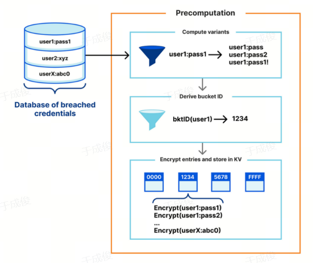
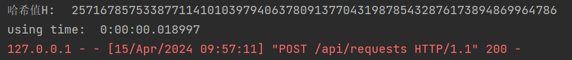

<h1 align = "center">密码学课程第四次实验报告</h1>

<h1 align = "center">实验名称：口令泄露查询密码协议系统构建</h1>


### 学号：2112066

### 姓名：于成俊

### 班级：密码班


## 一、实验目的

- 通过**实际编程**（**GPC**,**IDB**任选其一即可）了解口令泄露查询协议的交互过程，掌握口令泄露查询协议的基本设计和分析方法。
- 编写简单的客户端-服务器，具体要求如下：
  - 实现最基本的口令泄露查询，用户输入用户名-口令对，可以了解到她的输入凭证泄露、未泄露。
  - 保证系统的安全性，能防范恶意客户端的蛮力搜索，又能预防诚实且好奇服务器试图获取用户输入的口令信息。
  - 保护协议主体的隐私，在交互过程中用户不会泄露她所查询的用户名和口令的明文，服务器也不会向用户泄露额外的数据。
  - 支撑多用户；
  - 服务器显示日志，记录与客户端交互过程；
  - 编程语言不限，可以使用Python/C++/Go/Java等；
  - 数据报方式不限，可基于TCP或UDP；
  - 程序界面不限，可使用命令行界面或图形化界面。
  - 实验环境不限，可基于Linux/Windows等


## 二、实验内容说明

### （1）实验环境

- 系统：Windows 11
- 语言：Python 3.10
- IDE：PyCharm
- 数据库：MySQL

### （2）实验概述

- 首先，创建c3server_v3数据库，生成10万个用户名-口令对，创建information表，将数据插入其中。
- 然后，将数据按照用户名的哈希值前缀进行划分，具有同一哈希值用户名前缀的加密凭据划分在同一数据桶中。
- 最后，运行服务器程序和客户端程序，在客户端程序中，输入用户名-口令对，检查是否泄露。


## 三、实验原理

### （1）相关技术

#### 1.不经意伪随机函数

不经意伪随机函数（OPRF）包括发送方和接收方。其中，发送方输入秘密值x，接收方掌握OPRF密钥k，OPRF结合两者进行一系列运算得到输出。经过交互，发送方能够在不知道k的情况下恢复出OPRF输出，接收方学习不到任何关于x的知识，也不知道OPRF输出的值。具体而言，OPRF有多种实现方法。以2HashDH方案为例，如下图所示，其本质上是Chaum型的盲化Diffie-Hellman计算，在OM-gapDH假设下是安全的。


#### 2.Argon2哈希函数

Argon2是 2015 年 7 月密码哈希竞赛的获胜者，这是一种有意占用资源（CPU、内存等）的单向哈希函数。在 Argon2 中，我们可以配置盐的长度、生成的哈希长度、迭代次数、内存成本和 CPU 成本，以控制哈希密码所需的资源。

Argon2有两类输入参数：必选参数和可选参数。必选参数包括要加密的消息P和随机数 S，分别代表password和salt。P的长度是0到字节，S的长度是8到字节。可选参数包括：并行程度、Tag长度、内存大小、迭代器的个数、版本号、安全值 、附加数据、以及Argon2的类型，0代表Argon2d，1代表Argon2i，2代表Argon2id。

- Argon2d速度更快，并且使用数据依赖的内存访问方式，这使得它对GPU破解攻击有很强的抵抗力，适合没有side-channel timing attacks威胁的应用（例如加密货币）。
- Argon2i则使用数据无关的内存访问，这对于密码哈希和基于密码的密钥推导算法来说是首选，其特点是速度较慢，因为它在内存上运行了更多的处理逻辑，以防止 tradeoff attacks 。
- Argon2id是Argon2i和Argon2d的混合体，采用数据依赖型和数据独立型内存访问相结合的方式，从而可以同时抵御side-channel timing attacks和GPU破解攻击的能力。


### （2）协议描述

#### 1.系统架构

系统由客户端和服务器组成。服务器维护一个加密数据库，加盐存储与已泄露的用户名及口令相关的记录，根据用户名的哈希前缀划分出若干个加密数据桶；客户端通过提供用户名及口令来查询口令是否泄露。

当客户端输入要查询的用户名及口令，服务器首先根据用户名的哈希前缀判断是否存在对应的数据桶，如不存在则表明未泄露，查询结束；否则，将相应的数据桶返回给客户端。客户端根据服务器的响应来判断此次查询的口令是否泄露。

#### 2.安全模型

**恶意客户端：**恶意客户端可能希望通过查询获取另一个用户的口令。它可能知道目标的用户名，并有能力查询服务器。值得注意的是，服务器所使用的泄露数据集实际上已经被公开了，我们仍应该保护这些数据的私密性。

**诚实但好奇的服务器：**诚实即为它们不会伪造数据，将按照设定的协议执行，好奇则是指它们对用户的查询内容有一定程度的好奇，试图利用客户端的查询推测出更多的秘密信息，比如用户的口令。


#### 3.协议框架

本协议框架可以参考下图：


（1）创建数据库

数据库预处理流程可参考下图，要提供口令泄露查询的服务，服务器就必须事先构建一个包含所有已知泄露凭证的数据库。先对泄露凭证集进行数据预处理，再对数据进行加密运算得到$F_k(u||w)$，这里$F_k(\cdot)$是一个伪随机函数（PRF）。接着将凭证加密后所得数据的前缀作为数据桶的桶标识符 $b$，将加密后的凭证数据$F_k(u||w)$存储到标识符为$b$的数据桶中。



（2）客户端向服务器发送查询请求

数据库准备完毕后，用户通过与客户端执行私有集合交集（PSI），以实现信息的交互。用户先在客户端输入他的用户名和口令，客户端对输入凭证计算 $x$，同时计算该凭证预估所在的数据桶的桶标识符 $b$ 。并将两个数据发送给服务器。

（3）服务器向客户端发出响应

服务器用密钥 $k$ 对来自客户端的加密凭证进行幂运算，得到 $y$，并根据传入的桶标识符 $b$ 找到对应的数据桶 $z_b$，将 $y$ 和数据桶 $z_b$ 发送给客户端。

（4）客户端进行本地检验

客户端根据传入的 $y$ 计算出 $\widetilde x$ 。随后客户端检验 $\widetilde x$是否在服务器传来的数据桶 $z_b$ 中。若在数据桶中，则告知用户口令已泄露。否则，则告知用户口令没有泄露。

### （3）安全性分析

#### 1.数据安全性

在本系统中，为了防止敌手可能发起的离线字典攻击，服务器所维护的数据集与协议执行过程中所传输的数据均进行了加密，即使攻击者截获了客户端与服务器或者攻击服务器获取数据集，都无法获得明文信息，保证了数据的安全性。

#### 2.客户端隐私

-  查询者匿名性：服务器仅能从用户的查询请求中知道用户名的哈希前缀，无法在足够大的数据集中锁定用户的身份。我们可以通过控制所使用哈希前缀的长度来平衡查询者匿名性与服务器端存储数据桶的大小这两个因素。
- 查询内容隐私：服务器无法有效地获取所查询用户名或口令的明文。OPRF的语义安全性和哈希函数的单向性保证了这一点。
- 查询结果隐私：服务器无法知道用户的凭据是否与其加密数据库中的条目匹配。这是通过OPRF的语义安全性来实现的，服务器无法获知OPRF输出的值，也就无法知道所查询的用户凭证是否与桶中元素相对应。


#### 3.服务器隐私

除了服务器数据库中是否存在以所输入用户名的哈希前缀为索引的桶，以及查询口令的散列值是否与桶中元素匹配之外，用户无法了解有关服务器数据库的任何信息。这是通过OPRF的语义安全性来实现的，由于用户不知道服务器端用于加密的私钥，即使得到桶中的数据，也只能看到一些随机数，无法解密出含义。


#### 4.对抗拒绝服务攻击（DoS）

攻击者可能不停地向服务器发送查询请求，耗费服务器的带宽或缓冲区，导致服务器不能正常提供泄露查询服务。


#### 5.对抗离线猜测攻击

服务器端数据库使用基于2HashDH的OPRF加密存储，没有服务器的私钥 $k$，攻击者无法有效地恢复出明文。


## 四、实验步骤

- 创建信息表

  ```python
  # 建立数据库连接
      connect = pymysql.connect(
          host='localhost',
          port=3306,
          user='root',
          password='',
          database='c3server_v3',
          cursorclass=pymysql.cursors.DictCursor
      )
      # 创建游标对象
      cursor = connect.cursor()
  
      # SQL语句 (创建信息表)
      create_information_table = '''
          CREATE TABLE IF NOT EXISTS information (
              username VARCHAR(100) NOT NULL,
              password VARCHAR(100) NOT NULL
      );
      '''
      # 执行 SQL 语句
      cursor.execute(create_information_table)
  ```

- 由于没有数据源，我采用如下方式生成数据

  - 为了方便，让用户名和口令相等
  - 从0到99999，每次乘100，作为用户名和口令

  ```python
  # 向信息表插入10万条数据
      for i in range(100000):
           user_name=i*100
           user_password=user_name
           sql = "INSERT INTO information (username, password) VALUES (%s, %s)"
           values = (user_name, user_password)
           cursor.execute(sql, values)
  ```

- 接下来，为了提高用户数据的安全性，需要进一步处理用户的用户名和口令。首先，将用户名和密码连接在一起，然后使用 **SHA-224 哈希函数**对连接后的字符串进行哈希处理，并将哈希值转换为十六进制表示。接着，将十六进制的哈希值转换为一个整数，并**将这个整数映射到一个特定的曲线上**。然后，取哈希值的前两个字节作为表名，并在前面添加 “bucket_” 前缀。之后，对映射到曲线上的整数进行盲化处理，得到新的用户名。最后，创建一个新的数据库表（如果该表不存在），并将处理后的用户名和索引作为一条新的记录插入到数据库表中。代码如下：

  - **process函数**：

  ```python
  # 处理数据
  def process(username, password, cursor, index, b):
      # 将用户名和密码连接起来
      u = username + password
      # 使用 SHA-224 哈希函数对连接后的字符串进行哈希处理
      m = hashlib.sha224()
      m.update(u.encode('utf-8'))
      m.digest()
      u = m.hexdigest()
      # 将哈希值转换为十六进制，并将其转换为一个整数
      h = int(u, 16)
      # 将整数映射到一个特定的曲线上
      H = hashToCurve(h)
      print("H:\t", H)
      # 取u前两个字节作为表名存储盲化后的用户名H
      table_name = u[:2]
      table_name = "bucket_" + table_name
      # 对u进行盲化处理
      u = powMod(H, b, ep.p)
      print("table_name:\t", table_name)
      print("username:\t", u)
      # 创建SQL语句 (创建表)
      create_table = f'''
          CREATE TABLE IF NOT EXISTS {table_name} (
              user_index VARCHAR(100) NOT NULL,
              username VARCHAR(100) NOT NULL
          );
      '''
      # 执行 SQL 语句，创建表
      cursor.execute(create_table)
      # 将整数index转换为字符串
      str_index = str(index)
      # 创建SQL插入语句
      insert_data = f"INSERT INTO {table_name} (user_index, username) VALUES ('{str_index}','{u}')"
      # 执行SQL语句，插入数据
      cursor.execute(insert_data)
  ```

  - **处理数据**：

  ```python
  # 处理数据
      sqlQuery = "SELECT * FROM information"
      cursor.execute(sqlQuery)
      results = cursor.fetchall()
      b = 10
      index = 1
      for data in results:
          username = data['username']
          pwd = data['password']
          print("username:" + username + " pwd:" + pwd)
          process(username, pwd, cursor, index, b)
          index += 1
  
      # 关闭游标和数据库连接
      cursor.close()
      connect.commit()
      connect.close()
      print("End...")
  ```

- 在处理数据过程中，涉及的有关密码学的代码如下：(更基础的代码在ellipticcurve文件中)

  - 椭圆曲线参数

    ```python
    # 定义一个类，用于存储椭圆曲线的参数
    class ECCParameters():
        def __init__(self, p, a, b, Gx, Gy, o):
            self.p = p  # 素数p
            self.a = a  # 曲线参数a
            self.b = b  # 曲线参数b
            self.Gx = Gx  # 基点G的x坐标
            self.Gy = Gy  # 基点G的y坐标
            self.o = o  # 基点G的阶
    # 初始化椭圆曲线参数
    ep = ECCParameters(
        p=0xffffffffffffffffffffffffffffffff000000000000000000000001,
        a=0xfffffffffffffffffffffffffffffffefffffffffffffffffffffffe,
        b=0xb4050a850c04b3abf54132565044b0b7d7bfd8ba270b39432355ffb4,
        Gx=0xb70e0cbd6bb4bf7f321390b94a03c1d356c21122343280d6115c1d21,
        Gy=0xbd376388b5f723fb4c22dfe6cd4375a05a07476444d5819985007e34,
        o=0xffffffffffffffffffffffffffff16a2e0b8f03e13dd29455c5c2a3d)
    ```
  
  - 计算模幂运算
  
    ```python
    # 定义模幂运算函数
    def powMod(x, y, z) -> int:
        # 高效地计算 (x ^ y) % z
        number = 1
        while y:
            if y & 1:
                number = number * x % z
            y >>= 1  # y //= 2
            x = x * x % z
        return number
    ```
  
  - 将一个整数哈希映射到一个椭圆曲线上的点
  
    ```python
    # 创建椭圆曲线
    curve_secp224r1 = CurveFp(ep.p, ep.a, ep.b)
    # 创建基点G
    G = Point(curve_secp224r1, ep.Gx, ep.Gy, ep.o)
    # 定义哈希到曲线的函数
    def hashToCurve(x):
        # 打印输入的x值
        print("x:\t", x)
        # 将输入的x值赋给h
        h = x
        # 循环100次
        for k in range(0, 100):
            # 获取点的匹配y元素
            y_parity = 0  # 总是选择0
            # 计算a的值，这里的ep.p是椭圆曲线的一个参数
            a = (powMod(x, 3, ep.p) + 7) % ep.p
            # 计算y的值
            y = powMod(a, (ep.p + 1) // 4, ep.p)
            # 如果y的奇偶性与预期的y_parity不符，就用ep.p减去y
            if y % 2 != y_parity:
                y = ep.p - y
    
            # 尝试创建一个椭圆曲线上的点R
            try:
                R = Point(curve_secp224r1, x, y, ep.o)
            except Exception:
                # 如果创建失败，就将x加1然后继续下一次循环
                x = (x + 1) % ep.p
                continue
    
            # 如果R是无穷远点，或者R乘以ep.o不是无穷远点，就将x加1然后继续下一次循环
            if R == INFINITY or R * ep.o != INFINITY:
                x = (x + 1) % ep.p
                continue
            # 如果R满足条件，就返回R
            return R
        # 如果100次循环都没有找到满足条件的R，就返回h
        return h
    ```
  
- 服务器端代码：

  我使用 Flask 框架创建的 Web 服务，它接受 POST 请求并与 MySQL 数据库进行交互。首先，它创建了一个 Flask 应用实例，并启用了 CORS，允许来自不同源的请求。然后，它定义了一个函数 `check_table_existence`，用于检查指定的表是否存在于数据库中。这个函数执行一个 SQL 查询以获取所有的表名，然后检查给定的表名是否在查询结果中。接着，它定义了一个路由 `/api/requests`，该路由接受 POST 请求。对应的处理函数 `handle_requests` 首先记录开始时间，然后建立到 MySQL 数据库的连接，并创建一个游标对象。接着，它从 POST 请求中获取数据，包括表名和一个哈希值。如果指定的表不存在，函数返回一个 JSON 对象，其 “result” 字段的值为 “none”。否则，它执行一个 SQL 查询以从指定的表中获取所有记录，并遍历查询结果。如果找到一个记录，其第二个字段的值等于哈希值，函数关闭数据库连接，并返回一个 JSON 对象，其 “result” 字段的值为 “match”。如果没有找到匹配的记录，函数返回一个 JSON 对象，其 “result” 字段的值为 “none”。如果运行 Flask 应用，它将会监听所有 IP 地址的 5000 端口。

  ```python
  # 创建 Flask 应用实例
  app = Flask(__name__)
  # 启用 CORS，允许来自不同源的请求
  CORS(app, supports_credentials=True)
  # 设置 Flask 应用的调试模式为 False
  app.config['DEBUG'] = False
  
  # 定义一个函数，用于检查指定的表是否存在于数据库中
  def check_table_existence(name_of_table, db_cursor):  # 这个函数用来判断表是否存在
      sql_command = "show tables;"
      db_cursor.execute(sql_command)
      list_of_tables = [db_cursor.fetchall()]
      extracted_table_list = re.findall('(\'.*?\')', str(list_of_tables))
      extracted_table_list = [re.sub("'", '', each) for each in extracted_table_list]
      if name_of_table in extracted_table_list:
          return 1  # 存在返回1
      else:
          return 0  # 不存在返回0
  
  # 定义一个路由，该路由接受 POST 请求
  @app.route('/api/requests', methods=['POST'])
  def handle_requests():
      start_time = datetime.datetime.now()  # 记录开始时间
      # 建立数据库连接
      db_connect = pymysql.connect(
          host='localhost',
          port=3306,
          user='root',
          password='',
          database='c3server_v3',
          cursorclass=pymysql.cursors.DictCursor
      )
      # 创建游标对象
      db_cursor = db_connect.cursor()
      received_data = json.loads(request.get_data(as_text=True))  # 获取 POST 请求中的数据
      table_name = received_data['table_name']  # 获取表名
      hash_value = received_data['H']  # 获取哈希值
      print("哈希值H:\t", hash_value)
  
      if check_table_existence(table_name, db_cursor) == 0:  # 如果指定的表不存在
          print(table_name + ' not exists')
          end_time = datetime.datetime.now()  # 记录结束时间
          print("using time:\t", end_time - start_time)  # 打印程序运行时间
          return jsonify(result="none")  # 返回结果为 "none"
      else:
          sql_query = "SELECT * FROM " + table_name  # 构造 SQL 查询语句
          db_cursor.execute(sql_query)  # 执行 SQL 查询
          query_results = db_cursor.fetchall()  # 获取查询结果
          for row in query_results:
              second_key = list(row.keys())[1]
              if int(hash_value) == int(row[second_key]):  # 如果 Hash 值匹配
                  db_connect.close()  # 关闭数据库连接
                  end_time = datetime.datetime.now()  # 记录结束时间
                  print("using time:\t", end_time - start_time)  # 打印程序运行时间
                  return jsonify(result="match")  # 返回结果为 "match"
          end_time = datetime.datetime.now()  # 记录结束时间
          print("using time:\t", end_time - start_time)  # 打印程序运行时间
          return jsonify(result="none")  # 返回结果为 "none"
  
  # 运行 Flask 应用
  if __name__ == '__main__':
      app.run(host='0.0.0.0', port=5000)
  ```

- 客户端代码：

  下面的代码是一个客户端应用，它通过发送 POST 请求与一个运行在本地的服务器进行交互。首先，用户被提示输入用户名和密码。然后，用户名和密码被拼接在一起，并使用 SHA-224 哈希函数进行哈希处理。接着，哈希值被映射到一个椭圆曲线上得到一个点，然后计算该点的一个固定次方并对一个大素数取模，得到盲化后的用户名。哈希值的前两个字节被取出并添加前缀 “bucket_”，作为表名。然后，向服务器发出请求，请求数据包括表名和盲化后的用户名。服务器会检查指定的表是否存在，如果存在，就在表中查找与盲化后的用户名匹配的记录。如果找到匹配的记录，服务器返回一个 JSON 对象，其 “result” 字段的值为 “match”；否则，返回一个 JSON 对象，其 “result” 字段的值为 “none”。最后，打印程序运行时间。

  ```python
  import json
  import requests
  import hashlib
  from hashToCurve import hashToCurve, powMod, ep  # 导入自定义的哈希函数和模幂运算函数
  import datetime
  
  def send_request(tablename, H):
      # 向服务器发出请求的函数
      url = "http://localhost:5000/api/requests"  # 服务器地址
      headers = {'content-type': 'application/json'}  # 请求头部信息
      requestData = {"table_name": tablename, "H": H}  # 请求数据
      ret = requests.post(url, json=requestData, headers=headers)  # 发送 POST 请求
      if ret.status_code == 200:  # 如果请求成功
          text = json.loads(ret.text)  # 将返回的 JSON 数据解析为字典
          print(text)  # 打印返回的结果
      return text  # 返回请求结果
  
  # 获取哈希值
  def hash_username_password(username, password):
      username_password = username + password  # 将用户名和密码拼接在一起
      hash_obj = hashlib.sha224()  # 创建 SHA-224 哈希对象
      hash_obj.update(username_password.encode('utf-8'))  # 更新哈希对象的内容为拼接后的用户名和密码，并编码为 utf-8 格式
      hash_obj.digest()  # 计算哈希值
      hashed_username_password = hash_obj.hexdigest()  # 获取十六进制表示的哈希值
      return int(hashed_username_password, 16), hashed_username_password
  
  # 盲化用户名
  def blind_username(hash_value, hashed_username_password, blind_factor):
      point_x = hashToCurve(hash_value)  # 将整数哈希值映射到椭圆曲线上得到点 x
      print("生成的点x:\t", point_x)  # 打印生成的点 x
      # 取 username 的前两个字节作为表名存储盲化后的用户名 H
      bucket_name = hashed_username_password[:2]  # 取 username 的前两个字节作为表名
      bucket_name = "bucket_" + bucket_name  # 表名前加上 "bucket_"
      # 将 username 进行盲化处理
      blinded_username = powMod(point_x, blind_factor, ep.p)  # 计算 H 的 b 次方并对 ep.p 取模得到盲化后的 username
      print("table_name:\t", bucket_name)  # 打印表名
      print("username:\t", blinded_username)  # 打印盲化后的用户名
      return bucket_name, blinded_username
  
  if __name__ == '__main__':
      print("please input username:")  # 提示用户输入用户名
      user_name = input()  # 获取用户输入的用户名
      print("please input password:")  # 提示用户输入密码
      password = input()  # 获取用户输入的密码
      start = datetime.datetime.now()  # 记录开始时间
      # 盲化因子
      blind_factor = 10
      # 哈希值
      hash_value, hashed_username_password = hash_username_password(user_name, password)
      # 获取表名和盲化后的用户名
      bucket_name, blinded_username = blind_username(hash_value, hashed_username_password, blind_factor)
      # 向服务器发出请求
      result = send_request(bucket_name, blinded_username)
      end = datetime.datetime.now()  # 记录结束时间
      print("using time:\t", end - start)  # 打印程序运行时间
  ```

  

## 五、实验结果分析

- 信息表：

  

- 根据哈希值划分后：

  

- 在MySQL命令行中输入如下SQL语句，可以**查看服务器的存储开销**，以MB为单位。

  ```sql
  SELECT table_schema AS "Database", ROUND(SUM(data_length + index_length) / 1024 / 1024, 2) AS "Size (MB)" 
  FROM information_schema.TABLES 
  WHERE table_schema = "c3server_v3"
  GROUP BY table_schema;
  ```

  如下：

  

  可以看到，**10万条数据需要21.48MB空间**

- 运行服务器

  

- 运行客户端，进行查询（泄露的情况）：

  - 客户端：

    

  - 服务器端：

    

  可以看到，结果为**match**，说明该口令被泄露。客户端盲化后的用户名和服务器端存储的哈希值是一致的，客户端查询时间是**2.083912秒**，服务器端预处理运行时间为**0.016056秒**
  
  通过MySQL Workbench可以看到，所查询的用户名确实在bucket_b1表中，**结果正确**，如下图：
  
  
  
- 运行客户端，进行查询（未泄露的情况）：

  - 客户端：

    

  - 服务器端：

    

    可以看到，结果为**none**，说明该口令没有被泄露。客户端查询时间是**2.089395秒**，服务器端预处理运行时间为**0.018997秒**。由于我自己生成的用户名和密码都是100的倍数，所以确实不存在890，可知，**结果正确**。


## 六、拓展问题

### 1. 支持相似口令泄露查询，参见MIGP协议，需编程实现。

MIGP协议的一个重要特性是，它可以让客户端检查他们的确切密码是否在数据泄露中，也可以检查类似的密码是否被泄露例如，假设你去年的密码是amazon20，你每年都会更改密码（假设你现在的密码是amazon21）。如果去年的密码被泄露，MIGP可以告诉你，你现在的密码是弱的，容易被猜到，因为它是泄露密码的一个简单变体，可以利用SQL语法中的**LIKE关键字**来实现相似口令泄露查询，代码如下：

```python
import hashlib
import pymysql

def _connect():
    '''连接MySQL数据库'''
    try:
        db = pymysql.connect(
            host='localhost',
            port=3306,
            user='root',
            passwd='',
            db='c3server_v3',
            charset='utf8'
        )
        return db
    except Exception:
        raise Exception("数据库连接失败")

def get_hash_prefix(username):
    '''获取用户名的哈希值前缀'''
    hash_object = hashlib.sha256(username.encode())
    hex_dig = hash_object.hexdigest()
    return hex_dig[:5]  # 假设我们使用哈希值的前5位作为前缀

def migp_query(username, password):
    '''执行MIGP查询'''
    db = _connect()
    cursor = db.cursor()
    hash_prefix = get_hash_prefix(username)
    sql = "SELECT username, password FROM information WHERE hash_prefix = %s AND password LIKE %s"
    cursor.execute(sql, (hash_prefix, '%' + password + '%'))
    results = cursor.fetchall()
    db.close()
    return results

# 测试查询
username = 'test_user'
password = 'test_password'
print(migp_query(username, password))

```


### 2.当仅查询口令（不是用户名-口令对）是否泄露时，考虑通过重新规划桶来减少客户端的口令泄露，参见FSB协议，需编程实现。

FSB协议仅用于检查泄露的密码，并利用对人类选择的密码分布的知识来减少泄露。这个新协议为用户的密码提供了更强的保护，同时仍然可以实际部署。代码如下：

```python
import hashlib
import random

# FSB协议的一个简单实现
class FSBProtocol:
    def __init__(self, password_distribution):
        self.password_distribution = password_distribution

    def hash_password(self, password):
        return hashlib.sha256(password.encode()).hexdigest()

    def check_password(self, password):
        hashed_password = self.hash_password(password)
        bucket = self.assign_bucket(hashed_password)
        return self.check_bucket(bucket)

    def assign_bucket(self, hashed_password):
        # 假设我们有一个函数可以根据哈希值和密码分布将密码分配到一个桶中
        return self.password_distribution.assign_bucket(hashed_password)

    def check_bucket(self, bucket):
        # 假设我们有一个函数可以检查一个桶是否包含泄露的密码
        return self.password_distribution.check_bucket(bucket)

# 使用FSB协议
password_distribution = ...  # 假设我们有一个密码分布
fsb_protocol = FSBProtocol(password_distribution)
password = "password123"
is_compromised = fsb_protocol.check_password(password)
if is_compromised:
    print("Password is compromised!")
else:
    print("Password is safe!")

```


### 3. 如果一个恶意的服务器想要返回错误的查询结果，客户端能察觉吗？思考并设计新的协议来解决这一问题，无需编程。

如果一个恶意的服务器返回错误的查询结果，客户端可能无法直接察觉。因为客户端通常只能根据服务器的回应来判断查询结果，而无法直接访问服务器的数据库。

一种可能的解决方案是使用**零知识证明**（Zero-Knowledge Proofs，ZKP）的协议。零知识证明是一种密码学协议，允许一方（证明者）向另一方（验证者）证明他们知道某个值的信息，而不需要透露任何其他信息。在这种情况下，服务器可以使用零知识证明来证明他们的查询结果是正确的，而不需要透露他们的数据库中的任何信息。

这个协议的工作流程如下：

1. 客户端向服务器发送查询请求。
2. 服务器计算查询结果，并生成一个零知识证明，证明这个结果是正确的。
3. 服务器将查询结果和零知识证明一起发送给客户端。
4. 客户端验证零知识证明。如果证明是有效的，那么客户端就可以信任查询结果。

使用这个协议之后，即使服务器是恶意的，也无法伪造有效的零知识证明。因此，客户端可以通过验证零知识证明来确保查询结果的正确性。然而，零知识证明的计算和验证可能需要大量的计算资源，这可能会影响系统的性能。

### 4. 如果服务器使用的密钥 $k$ 泄露了，服务器能及时发现吗？思考并设计新的协议来解决这一问题（可以考虑与honeywords的结合)，无需编程。

如果服务器的密钥 k 泄露了，服务器可能无法立即发现，除非有明显的异常行为或者密钥被用于未授权的访问。

可以结合使用**密钥轮换**和**honeywords**来解决这个问题。Honeywords 是一种安全策略，通过在数据库中存储额外的假密码（honeywords）来检测未授权的访问。如果攻击者尝试使用这些假密码，系统就会知道有人正在尝试非法访问。

这个协议工作流程如下：

1. 服务器定期更换密钥 k，并将旧的密钥 k 存储在一个安全的地方。
2. 服务器在数据库中存储一些假的密钥（honeywords）。这些假密钥看起来和真正的密钥一样，但是实际上并没有任何权限。
3. 当有人尝试使用密钥 k 访问系统时，服务器会检查这个密钥是否是一个假密钥。如果是，那么服务器就知道有人正在尝试非法访问，并可以采取相应的措施，比如锁定账户，或者通知管理员。
4. 如果密钥 k 是真正的密钥，服务器会检查这个密钥是否是最新的密钥。如果不是，那么服务器就知道这个密钥可能已经泄露，并可以采取相应的措施，比如更换密钥。

使用这个方法之后，即使密钥 k 泄露，攻击者也无法确定他们拿到的是真正的密钥，还是假的密钥。而且，即使攻击者拿到了真正的密钥，他们也无法确定这个密钥是否还有效。然而，它需要服务器定期更换密钥，并且需要在数据库中存储额外的信息。


## 七、总结感想

在完成口令泄露查询密码协议系统构建的实验过程中，我不仅深入了解了密码学的基础知识，还掌握了如何在实践中应用这些知识。我学习了如何使用哈希函数和盲化技术来保护用户的隐私，这是密码学中的重要概念。同时，我还了解了如何创建 Web 服务，处理 POST 请求，以及如何与 MySQL 数据库进行交互，这些都是构建现代 Web 应用的关键技能。此外，我还学习了如何在命令行中运行 MySQL 命令，以及如何查看数据库的存储开销，这些技能对于理解和优化系统性能非常有帮助。总的来说，这个实验不仅提高了我的技术能力，也增强了我解决实际问题的能力。