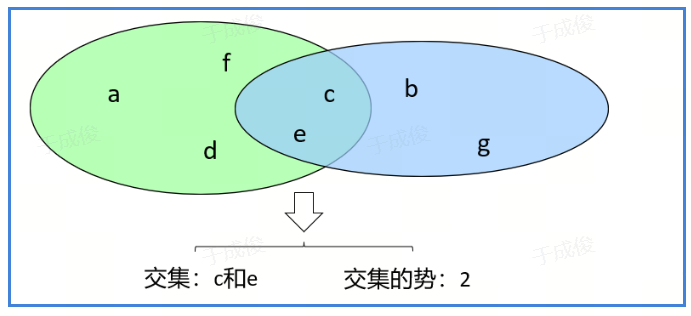
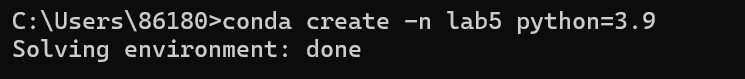
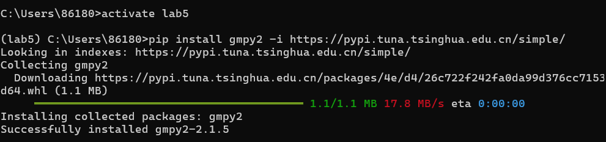
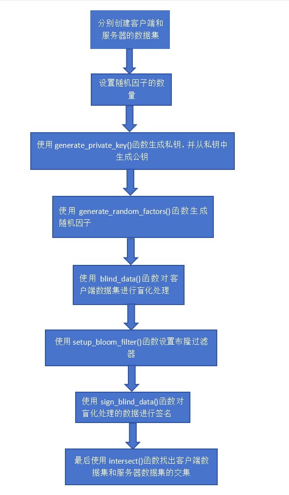
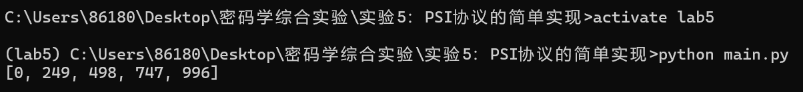

# 实验5：PSI协议的简单实现


### 学号：2112066

### 姓名：于成俊

### 专业：密码科学与技术


## 一、实验内容

本次实验通过使用 RSA 加密、盲签名和布隆过滤器等技术，简单实现了PSI协议，使得客户端和服务器可以找出他们的数据集的交集，而不需要彼此完全公开自己的数据集。这是一种非常重要的隐私保护技术，被广泛应用在各种需要保护用户隐私的场景中。


## 二、实验环境

- 系统：Windows 11
- 语言：python3.9


## 三、实验原理

### （1）密文集合交集运算

- PSI：Privacy Set Intersect, PSI是安全多方计算的一个子类

- 概念：两方隐私保护集合交集协议允许持有各自集合的两方来共同进行两个集合的交集计算。 协议最后的结果是一方或是两方得到正确的交集内容， 并且保证不会得到交集以外另一方集合中的任何信息。

- PSI-CA：交集集合元素的个数

- 场景：

  条件：Alice拥有一个集合A={a1,a2,…,am}，Bob拥有一个集合B={b1,b2,…bn}

​		问题：求得交集I={x;x∈A∩B}

​		要求：对于不属于交集I的元素，Alice不能获得集合B-(A ∩ B)的元素，Bob也不能获得集合 A-(A ∩ B)的元素。



-  PSI的两类场景

  平衡PSI：两方集合数量大体相等。

  非平衡PSI：两方集合元素个数差异很大，具体表现在一大一小。

  

本实验要求基于公钥加密的原理，实现一个两方半诚实安全的PSI协议。其中使用的哈希单向函数选择布隆过滤器BF，BF是一种多哈希函数映射的快速查找算法，可以判断出某个元素肯定不在或者可能在集合中，即不会漏报但可能会误报，通常应用在一些需要快速判断某个元素是否属于集合，但不严格要求正确的场合。


### （2）协议流程

- 客户端和服务器端约定使用的RSA算法的模n、公钥e、比特位数m以及布隆过滤器函数BF，服务器端数据集为$\left\{q_1,q_2,...,q_y\right\}$，客户端数据集为$\left\{p_1,p_2,...,p_x\right\}$；服务器端生成私钥d
- 客户端离线准备，随机生成随机数（盲因子）$r_i\;mod\;n$，并对自己的数据进行盲化处理，得到$p_i(r_i)^e \; mod \; n$，并计算盲化因子对应的逆元$r_i^{-1}$
- 服务器计算$BF((q_i)^d \;mod\;n)$
- 客户端发送盲化后的数据$p_i(r_i)^e\; mod\;n$
- 服务器对客户端的数据进行盲签名，发送盲签名后得到的$(p_i)^dr_i\;mod\;n$以及第三步中计算所得数据$BF((q_i)^d \;mod\;n)$
- 客户端计算$BF((p_i)^dr_ir_i^{-1} \;mod\;n)$获得$BF((p_i)^d \;mod\;n)$，并与从服务器端接收到的数据$BF((q_i)^d \;mod\;n)$进行比较匹配获得最终结果


### （3）实现方案

- 使用python实现。为了简化，通过range函数取range(0, 1024)作为服务器端的数据集合，取range(0, 1024, 249)（即0、249、498、747、996）作为客户端的数据集合。

- 基于gmpy2库实现RSA算法，主要使用其中的invert函数进行乘法逆元的计算，使用powmod函数进行公钥加密和私钥签名；基于pycryptodome库生成密钥。哈希单向函数使用的BF基于pybloom_live库实现。


## 四、实验步骤

### （1）搭建运行环境

- 使用命令`conda create -n lab5 python=3.9`创建虚拟环境

  

- 启动虚拟环境，输入下面的命令安装相关的库，注意，之所以要在后面加上`-i https://pypi.tuna.tsinghua.edu.cn/simple/`，是因为要指定清华源，否则会出现CondaHTTPError

  ```python
  pip install gmpy2 -i https://pypi.tuna.tsinghua.edu.cn/simple/
  pip install bitarray==1.7.1 -i https://pypi.tuna.tsinghua.edu.cn/simple/
  pip install pycryptodome -i https://pypi.tuna.tsinghua.edu.cn/simple/
  pip install pybloom_live -i https://pypi.tuna.tsinghua.edu.cn/simple/
  ```

  


### （2）编写程序实现

- 创建main.py文件，在其中编写代码。

- 导入相关包

  ```python
  import secrets
  import gmpy2
  import pybloom_live
  from Crypto.PublicKey import RSA
  ```

- 设置相关参数

  ```python
  RSA_BITS = 1024  # 设置 RSA 密钥的位数为 1024
  RSA_EXPONENT = 65537  # 设置 RSA 的公开指数为 65537
  RT_COUNT = 0  # 初始化 RT_COUNT 变量为 0
  ```

- 生成RSA私钥

  ```python
  # 生成RSA私钥
  def generate_private_key(bits=RSA_BITS, e=RSA_EXPONENT): 
      # 调用 RSA 的 generate 方法生成一个私钥，其中密钥的位数为 bits，公开指数为 e
      private_key = RSA.generate(bits=bits, e=e)   
      # 从私钥中生成对应的公钥
      public_key = private_key.publickey()  
      
      return private_key 
  
  ```

- 生成随机因子

  ```python
  # 生成随机因子
  def generate_random_factors(public_key):  
      # 初始化一个空列表 random_factors，用于存储随机因子
      random_factors = []  
      # 打开一个名为 'randomfactors.raw' 的文件，准备写入数据
      rff = open('randomfactors.raw','w') 
      # 循环 RF_COUNT 次
      for _ in range(RF_COUNT):  
          # 生成一个小于公钥 n 的随机数 r
          r = secrets.randbelow(public_key.n)  
          # 计算 r 在模 n 下的逆元 r_inv
          r_inv = gmpy2.invert(r, public_key.n)  
          # 计算 r 的 e 次方对 n 取模的结果，即对 r 进行 RSA 加密
          r_encrypted = gmpy2.powmod(r, public_key.e, public_key.n)  
           # 将 (r_inv, r_encrypted) 添加到 random_factors 列表中
          random_factors.append((r_inv, r_encrypted)) 
          # 将 r_inv 写入到文件中
          rff.writelines(f"{r_inv.digits()}\n")  
          # 将 r_encrypted 写入到文件中
          rff.writelines(f"{r_encrypted.digits()}\n")  
      rff.close()  # 关闭文件
      return random_factors  # 返回 random_factors 列表
  
  ```

- 对数据进行盲化处理

  ```python
  # 对数据进行盲化处理
  def blind_data(my_data_set, random_factors, n):          
  
      # 初始化一个空列表 A
      A = []
      # 打开一个名为 'blinddata.raw' 的文件，准备写入数据
      bdf = open('blinddata.raw','w')
      # 对 my_data_set 和 random_factors 中的每一对元素 p 和 rf 进行操作
      for p, rf in zip(my_data_set, random_factors):
          # 获取 rf 的第二个元素，即加密后的随机数 r
          r_encrypted = rf[1]
          # 计算 (p * r_encrypted) 对 n 取模的结果，即对数据进行盲化处理
          blind_result = (p * r_encrypted) % n 
          # 将盲化处理的结果添加到列表 A 中
          A.append(blind_result)
          # 将盲化处理的结果写入到文件中
          bdf.writelines(f"{blind_result.digits()}\n")
      # 关闭文件
      bdf.close()
      # 返回列表 A
      return A
  
  ```

- 设置一个布隆过滤器

  ```python
  # 设置一个布隆过滤器
  def setup_bloom_filter(private_key, data_set):
      # 设置布隆过滤器的模式为 SMALL_SET_GROWTH
      mode = pybloom_live.ScalableBloomFilter.SMALL_SET_GROWTH
      # 创建一个布隆过滤器实例 bf
      bf = pybloom_live.ScalableBloomFilter(mode=mode)
      # 对 data_set 中的每一个元素 q 进行操作
      for q in data_set:
          # 计算 q 的 private_key.d 次方对 private_key.n 取模的结果，即对 q 进行 RSA 签名
          sign = gmpy2.powmod(q, private_key.d, private_key.n)     
          # 将签名结果添加到布隆过滤器 bf 中
          bf.add(sign)                
      # 打开一个名为 'bloomfilter.raw' 的文件，准备写入数据
      bff = open('bloomfilter.raw','wb')
      # 将布隆过滤器 bf 的内容写入到文件中
      bf.tofile(bff)
      # 关闭文件
      bff.close()
      # 返回布隆过滤器 bf
      return bf
  
  ```

- 对盲化处理的数据进行签名

  ```python
  # 对盲化处理的数据进行签名
  def sign_blind_data(private_key, A):
      # 初始化一个空列表 B
      B = []
      # 打开一个名为 'signedblinddata.raw' 的文件，准备写入数据
      sbdf = open('signedblinddata.raw','w')
      # 对列表 A 中的每一个元素 a 进行操作
      for a in A:
          # 计算 a 的 private_key.d 次方对 private_key.n 取模的结果，即对 a 进行 RSA 盲签名
          sign = gmpy2.powmod(a, private_key.d, private_key.n)    
          # 将盲签名的结果添加到列表 B 中
          B.append(sign)
          # 将盲签名的结果写入到文件中
          sbdf.writelines(f"{sign.digits()}\n")
      # 关闭文件
      sbdf.close()
      # 返回列表 B
      return B
  
  ```

- 找出原始数据集中的哪些元素在布隆过滤器中

  ```python
  # 找出原始数据集中的哪些元素在布隆过滤器中
  def intersect(my_data_set, signed_blind_data, random_factors, bloom_filter, public_key):
      # 获取公钥的 n 值
      n = public_key.n
      # 初始化一个空列表 result
      result = []
      # 对 my_data_set，signed_blind_data 和 random_factors 中的每一对元素 p，b 和 rf 进行操作
      for p, b, rf in zip(my_data_set, signed_blind_data, random_factors):
          # 获取 rf 的第一个元素，即 r 的逆元 r_inv
          r_inv = rf[0]            
          # 计算 (b * r_inv) 对 n 取模的结果，即对盲签名的结果进行解盲处理
          to_check = (b * r_inv) % n
          # 如果解盲处理的结果在布隆过滤器 bloom_filter 中
          if to_check in bloom_filter:    
              # 将原始数据 p 添加到列表 result 中
              result.append(p)
      # 返回列表 result
      return result
  
  ```

- 主函数

  ```python
  # 主程序
  if __name__ == '__main__':
      # 创建客户端数据集，包含从 0 到 1024 的数，步长为 249
      client_data_set = list(range(0, 1024, 249))
      # 创建服务器数据集，包含从 0 到 1024 的所有整数
      server_data_set = list(range(0, 1024))
      # 设置随机因子的数量为客户端数据集的长度
      RF_COUNT = len(client_data_set)
  
      # 生成 RSA 私钥
      private_key = generate_private_key()   
      # 从私钥中获取对应的公钥
      public_key = private_key.public_key()
  
      # 生成随机因子
      random_factors = generate_random_factors(public_key)
      # 对客户端数据集进行盲化处理
      A = blind_data(client_data_set, random_factors, public_key.n)
  
      # 设置布隆过滤器
      bf = setup_bloom_filter(private_key, server_data_set)
  
      # 对盲化处理的数据进行签名
      B = sign_blind_data(private_key, A)
      
      # 找出客户端数据集和服务器数据集的交集
      result = intersect(client_data_set, B, random_factors, bf, public_key)
  
      # 打印交集结果
      print(result)
  
  ```

- 代码流程图如下：

  


## 五、实验结果

- 在main.py所在目录下运行命令行，使用命令`activate lab5`启动虚拟环境，然后使用命令`python main.py`运行程序。

  

- 从主函数可以看出，主函数是要找出客户端数据集和服务器数据集的交集。在这个例子中，客户端数据集是 `list(range(0, 1024, 249))`，即 `[0, 249, 498, 747, 996]`，而服务器数据集是 `list(range(0, 1024))`，即从 0 到 1023 的所有整数。

  在执行 `intersect` 函数时，它会遍历客户端数据集中的每一个元素，对每一个元素进行 RSA 盲签名的解盲处理，然后检查解盲处理的结果是否在布隆过滤器中。布隆过滤器是在 `setup_bloom_filter` 函数中设置的，其中包含了服务器数据集中的每一个元素的 RSA 签名。

  因此，`intersect` 函数的结果就是客户端数据集和服务器数据集的交集。在这个例子中，由于服务器数据集包含了从 0 到 1023 的所有整数，所以它肯定包含了客户端数据集中的所有元素。因此，`intersect` 函数的结果就是客户端数据集本身，即 `[0, 249, 498, 747, 996]`。结果正确！


## 六、实验感想

这个实验涉及到了许多复杂的概念和技术，包括 RSA 加密、盲签名、布隆过滤器等，这些都是信息安全中非常重要的知识。通过编写和理解这些代码，我不仅提高了自己的编程技能，也加深了对这些重要概念的理解。

​              

