# 大作业：差分隐私数据合成基础实验（小组报告）


### 小组成员：

- **于成俊  2112066**
- **柳致远  2113683**
- **曹昕城  2111446**


## 一、实验内容

学习经典的差分隐私数据合成算法 MWEM 和 Python 语言，然后在提供的 Python 代码框架的基础上，根据对算法各部分的描述设计各函数，完成对 MWEM算法的实现。完成的算法能运行于 Ubuntu 系统中，且能利用给定的实验数据集生成符合算法要求的合成数据。同时，也在此基础上对原始算法进行了一定的优化，即完成了二维的MWEM算法。


## 二、实验原理

### （1）差分隐私

差分隐私（Differential Privacy）最早于 2006 年由 Dwork 等人提出。其通过对原始数据添加随机噪音，确保数据集在输出查询结果时受单条记录改变的影响始终低于某个阈值，从而使攻击者无法根据查询结果的变化判断单条记录的更改或增删（如下图），同时整体的数据特征仍然可得到保留。在数据脱敏领域中，与在其出现之前较为常用的$ K- $匿名和$L-$多样化方法相比，差分隐私方法可有效抵御差分攻击，对个体隐私的保护能力更强。

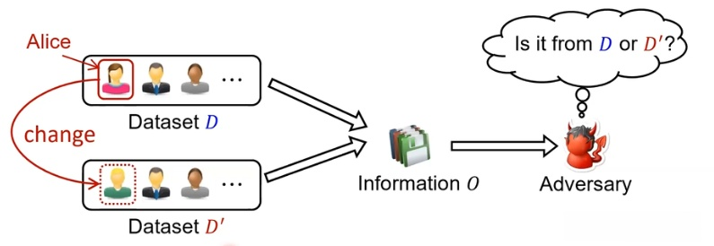

具体来说，设原始数据集为$𝐷$，我们对其上的任意一条记录进行修改或删除，或是增加一条新记录后，就得到了其相邻数据集$𝐷^{'}$。此时，对于一个任意随机化算法$𝐴$，若其满足：

$Pr\left\{𝐴(𝐷) = 𝑂\right\} ≤ 𝑒^{𝜖}Pr\left\{𝐴(𝐷^{′ }) = 𝑂\right\}$。

我们称该算法是满足差分隐私的。即，该算法作用于任何相邻数据集时，得到特定输出$O$的概率是相近的。

其中，$𝜖$是差分隐私的隐私预算。一般来说，隐私预算越小，对数据的隐私保护程度越大，但是数据的可用性越差；隐私预算越大，数据的可用性越好，但是隐私保护能力越差。通过对隐私预算的设计，可实现差分隐私算法在隐私保护程度和数据可用性之间的权衡。

### （2）差分隐私数据合成

现有的差分隐私数据发布方案按照查询的操作方式可分为两种，即交互式差分隐私和非交互式差分隐私。

其中，交互式差分隐私模型是由用户向数据管理者提出查询操作请求，数据管理者再根据查询请求对数据集进行操作，并对结果进行扰动后反馈给用户。该模型能够保证查询者无法知晓数据全貌，从而保护数据集中的给个体隐私。

基于该模型的方案目前已大量应用于诸如个性化广告推荐、社交网络趋势分析、基于用户兴趣的商品推荐等场景中，在银行、车企、零售等行业中提供保护隐私的用户洞察服务。一般来说，交互式模型方案多与数据库引擎间集合紧密，以引擎中间件的形式处理查询请求，返回满足差分隐私的查询结果。由于该模型并未对数据集本身进行处理，其对数据集的动态更新支持较好，适合于各类数据更新频繁且分析者对数据新鲜度敏感的场景。

然而，虽然交互式模型目前已有较为成熟的应用，且能够有效抵御差分攻击，但由于每次查询均需要消耗一定量的隐私预算(Budget)，当隐私预算消耗完毕后，就无法再继续查询，其仅能支持有限次查询。此外，交互式模型即使多次进行同一个查询，其查询结果由于噪音扰动也可能是不同的，不具有一致性，用于数据分析时的效果欠佳。

针对交互式差分隐私模型的查询支持次数有限及查询不具有一致性的问题，目前有许多方案使用非交互式差分隐私模型来支持查询。在该模型下，数据管理者对原始数据集进行处理，并发布一个原始数据的“合成净化”版本，即合成数据集，因此该类方案也称为差分隐私的数据合成方案。查询用户可对该合成数据集自行进行所需的查询操作。

该模型方案更适合于需要进行大量查询的场景和数据集处理与后续存储分离的场景。当数据使用方有离线查询的需求时，非交互式模型生成的合成数据集可支持与原始数据集所支持的所有查询。因此，非交互式模型非常适合于敏感领域大数据分析(如医疗，金融，人口信息等)、数据分析外包、多方共用数据分析等场景下的保护隐私的数据分析服务，其发布后无需数据发布者进一步参与的特性使其能适应多种类型的系统。

由于该方法的加噪过程完成于“合成净化”阶段，对合成后的数据进行查询满足差分隐私的后处理鲁棒性。其在查询时不再消耗隐私预算，故其可支持无限次查询，同时对于相同查询的响应结果具有一致性。因此，数据合成方案是更适合于在海量数据分析过程中保护个体数据隐私的方案。

### （3）指数机制

如前所述，差异隐私是对随机计算的一种约束，即计算不应透露输入中存在的个别记录的细节。一个满足差分隐私的机制应在任何两个足够接近的数据集上表现得几乎相同。

那么，设想一个场景：数据集$𝐴$的记录来源于一个抽象域$𝐷$，其可被描述为一个来源于$𝐷$的函数，它被描述为一个从$𝐷$到自然数$ℕ$的函数，那么$𝐴(𝑥)$即可表示$𝑥$在数据集中的频率（出现的次数）。我们利用$‖𝐴 − 𝐵‖$来描述表示频率差异的绝对值之和（要增加或删除多少条记录才能将 $$$$ 变为 $B$）。

指数机制(Exponential Mechanism)是一个$\epsilon$ −差分隐私化的机制，其可被用于在一组离散的备选项组成的集合中选择最佳匹配项，而该“最佳”是由一个与每个备选项和基础的秘密数据相关的函数所定义的，并非一个归一化的指标。

形式化地，对于一组备选项组成的集合$R$，我们需要设定一个质量打分函数$s: dataset × 𝑅 → ℝ$，其中关于$B$和$r$的函数$s(B,r)$可被解释为数据集$B$的结果$r$的质量。为了保证差分隐私，该函数还必须满足以下的稳定属性：对于每个结果$r$来说，$|s(A,r)-s(B,r)$的最大值为$||A-B||$。此时，指数机制$E$从分布中选择$r$，其中$r$满足：$Pr[𝐸(𝐵) = 𝑟] ∝ exp(𝜀 × 𝑠(𝐵, 𝑟)/2)$

在上式中，$∝$符号意为该式的左值和右值成正比。因此，根据上式我们可以看出，该机制选择结果$r$的概率是以指数方式偏向其质量分数的。总地来说，指数机制需要的时间与可能的结果数量成线性关系，对于每个$r$均产生一个$s(B,r)$。

### （4）MWEM-基于乘法权重的指数机制算法

MWEM(Multiplicative Weights Exponential Mechanism)是一种简单高效的数据合成发布算法，其迭代地执行指数机制-乘法权重更新，不断地优化一个对真实数据分布的估计，以期在合入噪音的同时，尽可能地使合成数据关于查询集合$𝑄$的结果与原始数据一致。

具体来说，MWEM 首先生成一个对给定的真实数据集的估计模型(approximation)，此后进行一个多轮迭代过程。在每轮迭代中，首先使用选择机制选出使用近似数据模型对一给定查询集进行响应时误差最大的查询，然后利用真实数据集对该查询的响应来改进这个估计，以让此估计模型能够更好地反映查询的真实答案，从而迭代地提升由该估计模型产生的私有数据集在响应给定查询集时的准确性。

MWEM 机制的每次迭代均可分为三步，即选择-测量-乘法权重更新。选择过程使用指数机制来选定本轮所用估计模型对给定查询集响应最差的查询，然后使用原始数据集响应该查询，并利用测量机制为该响应添加拉普拉斯噪音。最后，利用乘法权重机制来进行更新。

乘法权重方法(Multiplicative Weight)在计算机科学的许多领域都有应用。$MWEM $机制中使用的是$ Hardt $和 $Rothblum $提出的方法，该方法反复改进一个数据集的近似分布，以期能够更好地反映真实分布的特征。乘法权重的基础逻辑是，若我们发现一个查询在真实数据上响应比它在近似数据上的响应大得多，我们应该提高对错误率有正向贡献的记录的近似权重，降低对错误率有负向贡献的记录的权重。如果真实数据的响应远小于近似数据的响应，应进行相反的操作。

接下来，我们将形式化描述 $MWEM$使用的乘法权重算法。若$A$和$B$是两个位于记录域$D$上的分布，其中$𝐴$是一个用于估计关于查询$𝑞$的真实分布$𝐵$的合成分布。此时，乘法权重更新规则会倾向于通过以下方式更新$𝐴$对每条记录$𝑥$的权重:

$$𝐴_{new}(𝑥) ∝ 𝐴(𝑥) × exp(𝑞(𝑥) × (𝑞(𝐵) − 𝑞(𝐴))/2$$

其中，正比符号表明了近似值在进行缩放后应进行重新规范化。$Hardt$ 和 $Rothblum$的研究表明，每次应用这一规则时，$𝐴$和$𝐵$之间的相对熵(relative entropy)都会以$(q(A)-q(B))^2$的形式加法级别减少。因此，只要我们能继续找到结果不一致的查询，我们就能继续对估计分布进行改进。


## 三、实验环境

- 系统：Ubuntu 18.04.6 LTS
- 语言：Python  3.6.9


## 四、MWEM一维实现

### （1）MWEM函数实现

**MWEM算法流程如下**：

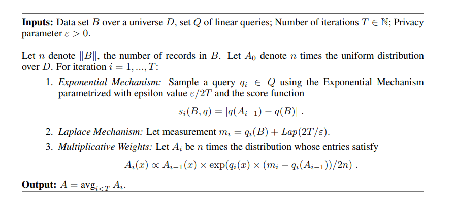

**MWEM算法**主要分为以下四步：

- **初始化**：开始时，算法会初始化一个猜测数据分布。
- **选择查询**：使用指数机制（Exponential Mechanism）选择一个具有最大误差的查询。
- **更新策略**：使用乘法加权更新规则（Multiplicative Weights Update Rule）来调整数据分布，以减少选择查询的误差。
- **重复迭代**：重复选择查询和更新策略的过程，直到达到预设的迭代次数或误差阈值。MWEM 机制的每次迭代均可分为三步，即选择-测量-乘法权重更新。选择过程使用指数机制来选定本轮所用估计模型对给定查询集响应最差的查询，然后使用原始数据集响应该查询，并利用测量机制为该响应添加拉普拉斯噪音。最后，利用乘法权重机制来进行更新。

**补全代码**如下：

```Python
# B:原始数据
# Q:查询集
# T:迭代次数
# eps:隐私预算
# repetitions:乘法权重算法的重复次数
def MWEM(B, Q, T, eps, repetitions):
    # 生成真实的直方图，其逻辑是，找到数据集中有效属性的最大值和最小值
    # 然后以其差值生成一个拥有差值+1个桶的直方图，以列表形式存储
    minVal = min(B)
    length = max(B) - minVal + 1
    histogram = [0]*(length)
    for val in range(len(B)):
        histogram[B[val] - minVal] += 1
    # 初始化数据合成流程
    nAtt = 1
    A = 0
    n = 0
    n = sum(histogram)
    A = [n/len(histogram) for i in range(len(histogram))]    # 生成一个分布平均的数据分布作为初始分布
    measurements = { } #mesurements是一个dict类型，其初始化时应该以{ }初始化
    # 迭代优化循环体
    for i in range(T):
        print("ITERATION ROUND#" + str(i))
        qi = ExpM(histogram, A, Q, eps/(2 * T))
        j = 1
        print("选中了"+str(Q[qi]))
        while(qi in measurements):
            qi = ExpM(histogram, A, Q, eps/(2 * T))
            print("选定的值已被观测过，启动重选，重选第"+str(j)+"次")
            j+=1
            print("选中了"+str(Q[qi]))
        evaluate = Evaluate(Q[qi],histogram)       # 对查询值进行观测并加入已观测的列表中
        lap = Laplace((2*T)/(eps*nAtt))
        measurements[qi] = evaluate + lap
        # 乘法权重更新开始
        MultiplicativeWeights(A, Q, measurements, repetitions)
    return A, histogram
```

**补全的点**为：

1. 添加指数查询机制，即调用ExpM(histogram, A, Q, eps/(2 * T))，反馈查询集合Q中qi的位置。
1. 添加循环条件while(qi in measurements)查看该查询是否已经在mesurements内存储，若已有则重启选择，直到选中未优化过的查询。

补全之前：

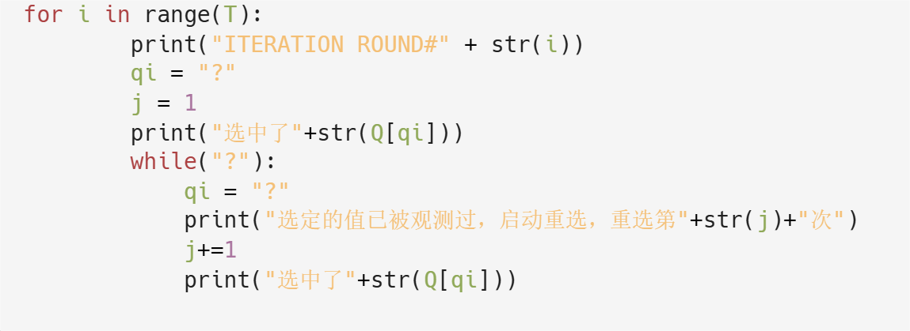

补全之后：

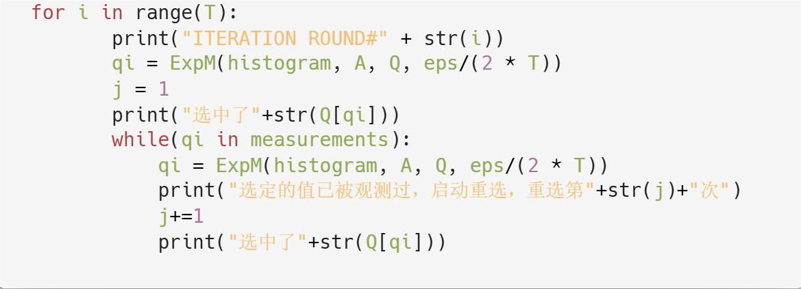


### （2）ExpM函数的实现

**指数机制**（Exponential Mechanism）是一种用于选择最优输出的差分隐私机制。它根据查询的得分来选择输出，得分越高的查询被选择的概率越大。在本代码中，查询的得分是基于原始数据和合成数据在响应同一个查询时的差异绝对值计算的。

我们需要实现以下步骤：

1. **计算每个查询的得分**：
   1. 我们需要计算原始数据（B）和合成数据（A）在同一个查询（Q[i]）上的差异绝对值。为了避免数值太大导致指数计算时的溢出问题，我们将差异绝对值除以100000。
2. **将得分转换为选择概率**：
   1. 使用指数机制将得分转换为选择概率。每个查询的概率是其得分的指数值。
3. **归一化选择概率**：
   1. 计算每个查询的选择概率后，我们需要将这些概率归一化，使它们的和为1。这样才能作为概率分布进行随机选择。
4. **随机选择查询**：
   1. 根据归一化后的概率分布，从查询集中随机选择一个查询。

基于上，我们按如下方式补全代码：

**1. 计算每个查询的得分**

对每个查询计算其在原始数据和合成数据上的差异绝对值，然后除以100000来缩小错误的规模。

```Python
for i in range(len(scores)):
    scores[i] = abs(Evaluate(Q[i], B) - Evaluate(Q[i], A)) / 100000
```

**解释**：

- `Evaluate(Q[i], B)`：计算查询Q[i]在原始数据B上的值。
- `Evaluate(Q[i], A)`：计算查询Q[i]在合成数据A上的值。
- `abs(...)`：取差异的绝对值。
- `... / 100000`：将差异值除以100000以防止数值过大导致计算问题。

**2. 将得分转换为选择概率**

使用指数机制计算每个查询的选择概率。

```Python
max_score = max(scores)
# 基于分数计算每个查询被选中的概率，并减去最大值以稳定数值
Pr = [np.exp(eps * (score - max_score)/2.0) for score in scores]
```

**解释：**

- 该部分基于指数机制的基本公式$Pr[𝐸(𝐵) = 𝑟] ∝ exp(𝜀 × 𝑠(𝐵, 𝑟)/2)$
- `np.exp(...)`：计算指数值。

**3. 归一化选择概率**

将概率归一化，使它们的和为1。

```Python
# 规范化概率，使概率之和为1
Pr_sum = sum(Pr)
Pr = [p / Pr_sum for p in Pr]  # 归一化概率
```

**4. 随机选择查询**

根据归一化后的概率分布，从查询集中随机选择一个查询。

```Python
# 基于生成的概率表抽取查询并进行返回
index = [i for i in range(len(Q))]
return random.choices(index, Pr, k=1)[0]
```

**5. 最终补全代码如下：**

```Python
# ExpM-使用指数机制来选定一个查询
# 本部分算法原理：首先测量对原始数据集和合成数据运行同一个查询时其之间的误差作为打分函数，
# 根据各查询得分的多少计算出每个查询被选中的概率，之后基于这些概率随机抽取一个查询。
def ExpM(B, A, Q, eps):
    scores = [0] * len(Q)  # 初始化一个Q长度的打分列表
    for i in range(len(scores)):
        # 计算每个查询在A和B上的差异，并除以100000以进行缩放
        scores[i] = abs(Evaluate(Q[i], A) - Evaluate(Q[i], B)) / 100000
    max_score = max(scores)
    # 基于分数计算每个查询被选中的概率，并减去最大值以稳定数值
    Pr = [np.exp(eps * (score - max_score)/2.0) for score in scores]
    Pr_sum = sum(Pr)
    Pr = [p / Pr_sum for p in Pr]  # 归一化概率
    # 基于生成的概率表抽取查询并进行返回
    index = [i for i in range(len(Q))]
    return random.choices(index, Pr, k=1)[0]
```

  

### （3）MultiplicativeWeights函数的实现

本函数实现了乘法权重更新。其维护一个循环体，共循环repetitions（本实验设为20）次，每次循环开始时，其先对measurements进行洗牌，然后遍历每次打乱后的查询列表update_order做乘法权重的更新，每次更新后对A进行归一化处理。

**函数代码**如下：

```Python
def MultiplicativeWeights(A, Q, measurements, repetitions):
    total = sum(A)
    for iteration in range(repetitions):
        # 在每次迭代中，随机打乱查询的顺序
        update_order = list(measurements.keys())
        random.shuffle(update_order)
        # 对每个查询进行更新
        for qi in measurements:
            error = measurements[qi] - Evaluate(Q[qi], A) 
            query = queryToBinary(Q[qi], len(A))
            # 根据误差更新每个元素的权重
            for i in range(len(A)):                 
                A[i] = A[i] * math.exp(query[i] * error/(2.0*total))
            # 规范化权重以保持总和不变      
            count = sum(A)
            for k in range(len(A)):
                A[k] *= total/count
```

**解释：**

- 对measurements生成随机的更新顺序的目的是为了减少系统性偏差以及增强算法的鲁棒性，防止算法陷入局部最优而错过全局最优解。
- 标志位列表query保证了乘法权重更新函数只更新所选查询范围内的合成数据。

  涉及的主要公式为：  

         **A[i] = A[i] \* np.exp(query[i] \* error / (2.0 \* total))** 

这里把qi(x)看作１，error由 **error = measurements[qi] - Evaluate(Q[qi], A)** 计算可得，可以轻易看出，若真实数据相应大于近似数据则error为正值，即可实现提高对错误率有正向贡献的记录的近似权重。而若真实数据相应小于近似数据则error为负值，即可实现提高对错误率有负向贡献的记录的近似权重。


### （4）Laplace函数实现

**代码如下：**

```python
# 利用给定的sigma来生成拉普拉斯随机数noise作为噪音。
def Laplace(sigma):
    return np.random.laplace(loc=0, scale=sigma)
```

利用numpy库来生成拉普拉斯分布随机数


## 五、MWEM二维实现

### （1）MWEM函数的实现

**补全代码**如下：

```Python
def MWEM(B, Q, T, eps, repetitions):
    # 初始化真实数据集对应的直方图
    minRow = min(B[0])
    minCol = min(B[1])
    rows = max(B[0]) - min(B[0]) + 1 #age
    columns = max(B[1]) - min(B[1]) + 1 #satisfaction

    histogram = matrixCreation(B,rows,columns,minRow,minCol)

    # 初始化数据合成流程
    nAtt = 2 # 二维
    A = []
    n = 0
    # 初始化一个分布平均的查询作为初始的分布
    # 先算所有行的每行加和，再将这些sum值再次sum，得到总矩阵的和
    # 然后平均分配给矩阵各个单元格
    m = [sum(histogram[i]) for i in range(len(histogram))]
    n = sum(m)
    value = n/(rows*columns)
    A = [[0]*(columns) for i in range(rows)]
    for i in range(len(histogram)):
        for j in range(len(histogram[i])):
            A[i][j] += value

    measurements = {} # esurements是一个dict类型，其初始化时应该以{ }初始化
    # 迭代优化循环体
    for i in range(T):
        print("ITERATION #" + str(i))
        qi =  ExpM(histogram, A, Q, eps / (2*T))
        j = 1
        print("选中了"+str(Q[qi]))
        while(qi in measurements):
            qi = ExpM(histogram, A, Q, eps/(2 * T))
            print("选定的值已被观测过，启动重选，重选第"+str(j)+"次")
            j+=1
            print("选中了"+str(Q[qi]))

        # 对查询值进行观测并加入已观测的列表中
        evaluate = Evaluate(Q[qi],histogram)
        lap = Laplace((2*T)/(eps*nAtt))
        measurements[qi] = evaluate + lap

        # 乘法权重更新开始
        MultiplicativeWeights(A, Q, measurements, repetitions)

    return A, histogram
```

**增加的点：**（和一维基本一致）

1.在初始化时，创建了 A_sum 和 A_avg 两个矩阵，用于存储权重值的累加和平均值。而且它们被设置为全零矩阵。

2.在代码的最后通过循环对每个单元格进行累积权重值的计算，并在迭代结束后再通过循环计算平均值。

3.此处对于qi的位置查询调用与一维一致，调用ExpM函数

While（）循环中，如果出现与此前一致的查询则再运行一次算法，直到选中从未优化过的查询，也就是说查看该查询是否已经在mesurements内存储，若已有则重启选择，直到选中未优化过的查询。

### （2）ExpM函数的实现

与一维一样，这里不再赘述。

### （3）MultiplicativeWeights函数的实现

MWEM的二维实现中乘法权重更新函数与一维的主要区别在于再乘法权重更新公式中从线性的一维数组遍历变成二维的矩阵遍历。

即由**A[i] = A[i] * np.exp(query[i] * error / (2.0 * total))**变为

**A\[i]\[j] = A\[i]\[j] * np.exp(query\[i]\[j] * error/(2.0*total))** 

其他部分的原理相同。

具体代码如下：

```Python
def MultiplicativeWeights(A, Q, measurements, repetitions):
    m = [sum(A[i]) for i in range(len(A))]
    total = sum(m)
    for iteration in range(repetitions):
        # 在每次迭代中，随机打乱查询的顺序
        update_order = list(measurements.keys())
        random.shuffle(update_order)
        # 对每个查询进行更新
        for qi in update_order:
            error = measurements[qi] - Evaluate(Q[qi], A)
            query = queryToBinary(Q[qi], len(A[0]), len(A))
            # 根据误差更新每个元素的权重
            for i in range(len(A)):
                for j in range(len(A[i])):             
                    A[i][j] = A[i][j] * np.exp(query[i][j] * error/(2.0*total)) 
            # 规范化权重以保持总和不变      
            m = [sum(A[i]) for i in range(len(A))]
            count = sum(m)
            for k in range(len(A)):
                for l in range(len(A[k])):
                    A[k][l] *= total/count
        return A
```

### （4）Laplace函数实现

与一维一样，这里不再赘述。

### （5）randomQueries函数实现

**代码如下**：

```python
# 随机生成Q_size个查询，并对查询集中的已有查询规避
def randomQueries(Q_size, maxVal1, minVal1,maxVal2,minVal2):
    # 此时生成的是一个列表嵌套字典的格式
    Q=[]
    count_regen = 0
    for i in range(Q_size):
        down1 = random.randint(0, maxVal1 - minVal1)
        upper1 = random.randint(down1, maxVal1 - minVal1)
        down2 = random.randint(0, maxVal2 - minVal2)
        upper2 = random.randint(down2, maxVal2 - minVal2)

        while {(down1,upper1):(down2,upper2)} in Q:
            down1 = random.randint(0, maxVal1 - minVal1)
            upper1 = random.randint(down1, maxVal1 - minVal1)
            down2 = random.randint(0, maxVal2 - minVal2)
            upper2 = random.randint(down2, maxVal2 - minVal2)
            count_regen+=1

        Q.append( {(down1,upper1):(down2,upper2)})

    print("查询集随机生成完毕，生成了"+str(Q_size)+"个查询，共进行规避生成"+str(count_regen)+"次")
    return Q
```

参考一维的randomQueries函数实现，由于代码逻辑简单，且在指定查询集后，用不到这个函数，这里就不再赘述。


## 六、结果展示

**参数设置**如下：

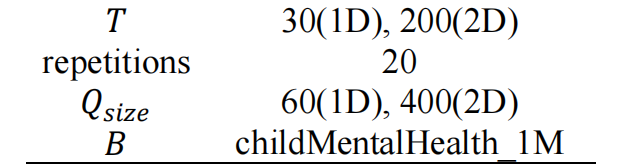

接下来，我们会展示隐私预算分别为0.1，1，5和10的结果。

### （1）MWEM一维

当计算**各项误差**时，为了尽量排除随机性，我们仿照实验参考书的方法，即运行100次取平均值，为此，我们增添了如下代码：

```python
AvgMax=0
AvgMin=0
AvgMSE=0
AvgMean=0
for i in range(100):
    max_Error, min_Error, mean_SqErr, mean_Error = main()
    AvgMax += max_Error/100
    AvgMin += min_Error/100
    AvgMSE += mean_SqErr/100
    AvgMean += mean_Error/100


histoDraw(RealHisto, syntheticData, B)
print()
print()
print("    - AvgMaxError: " + str(AvgMax))
print("    - AvgMinError: " + str(AvgMin))
print("    - AvgMeanSquaredError: " + str(AvgMSE))
print("    - AvgMeanError: " + str(AvgMean))
```

注意，展示的柱状图和折线图是最后一次的运行结果。

其中参考误差如下图：

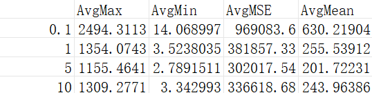

#### 1.  隐私预算eps=0.1

**100次运行的各项误差的平均值**：（符合各项误差与参考误差间的差距不超过10%的要求）

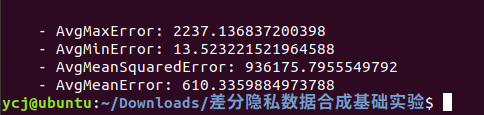

**单次运行的误差及对应的直方图、折线图如下**：

<div align="center">
    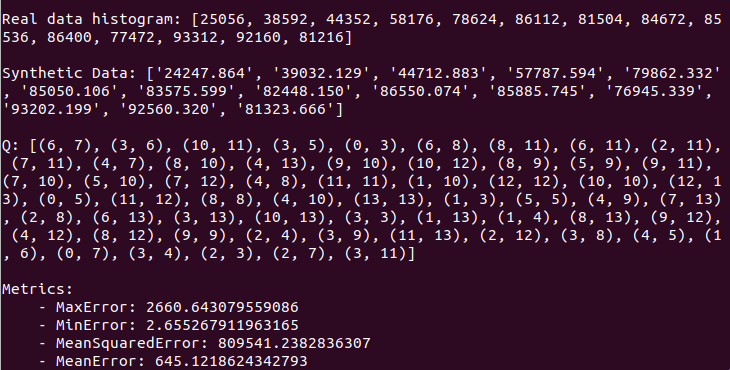
    
    
</div>


#### 2.  隐私预算eps=1

**100次运行的各项误差的平均值**：（符合各项误差与参考误差间的差距不超过10%的要求）

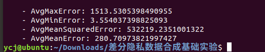

**单次运行的误差及对应的直方图、折线图如下**：

<div align="center">
    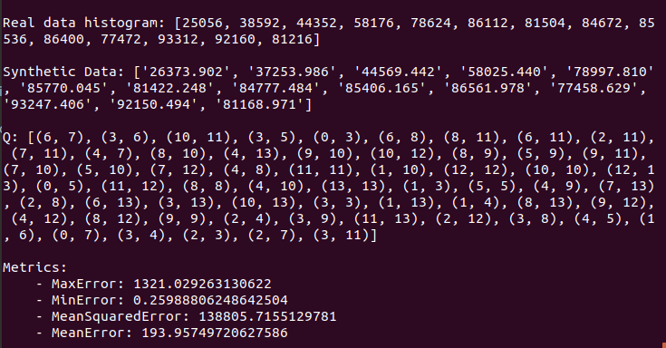
    
    
</div>


#### 3.  隐私预算eps=5

**100次运行的各项误差的平均值**：（符合各项误差与参考误差间的差距不超过10%的要求）

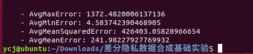

**单次运行的误差及对应的直方图、折线图如下**：

<div align="center">
    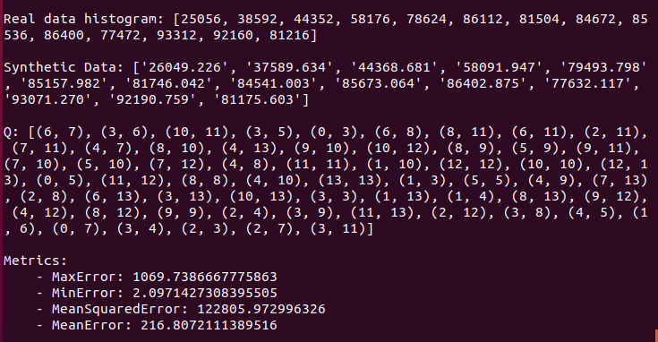
    
    
</div>


#### 4.  隐私预算eps=10

**100次运行的各项误差的平均值**：（符合各项误差与参考误差间的差距不超过10%的要求）

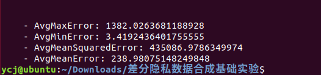

**单次运行的误差及对应的直方图、折线图如下**：

<div align="center">
    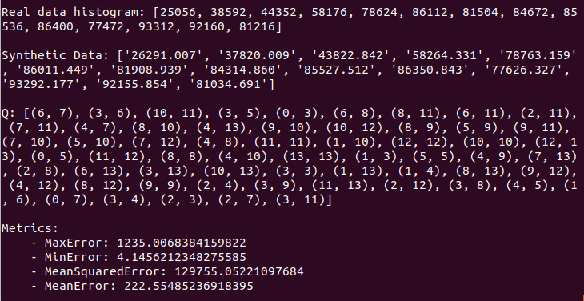
    
    
</div>


### （2）MWEM二维

与一维一样，当计算**各项误差**时，我们依旧采取运行100次取平均值的方法，然后，展示最后一次运行结果的效果图。

其中参考误差如下图：

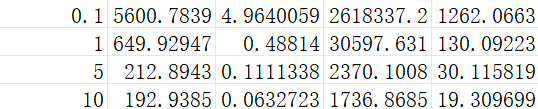

#### 1.  隐私预算eps=0.1

**100次运行的各项误差的平均值**：（不符合各项误差与参考误差间的差距不超过10%的要求，感觉参考误差有些奇怪）

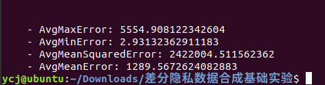

**单次运行的误差及对应的原始数据的染色图和合成数据的染色图如下**：(上面的为原始数据染色图)

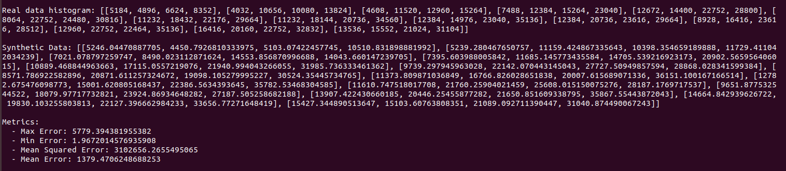

<div align="center">
    
    
</div>

#### 2.  隐私预算eps=1

**100次运行的各项误差的平均值**：（不符合各项误差与参考误差间的差距不超过10%的要求，感觉参考误差有些奇怪）

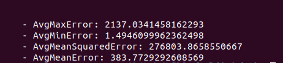

**单次运行的误差及对应的原始数据的染色图和合成数据的染色图如下**：(上面的为原始数据染色图)

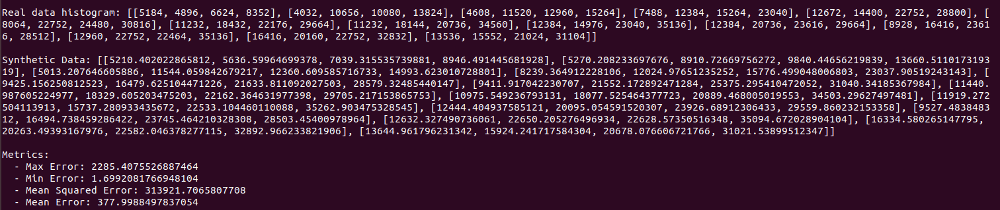

<div align="center">
    
    
</div>

#### 3.  隐私预算eps=5

**100次运行的各项误差的平均值**：（不符合各项误差与参考误差间的差距不超过10%的要求，感觉参考误差有些奇怪）

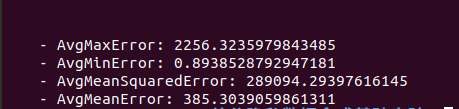

**单次运行的误差及对应的原始数据的染色图和合成数据的染色图如下**：(上面的为原始数据染色图)

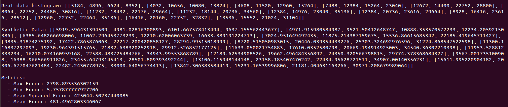

<div align="center">
    
    
</div>

#### 4.  隐私预算eps=10

**100次运行的各项误差的平均值**：（不符合各项误差与参考误差间的差距不超过10%的要求，感觉参考误差有些奇怪）

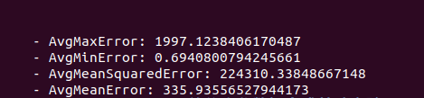

**单次运行的误差及对应的原始数据的染色图和合成数据的染色图如下**：(上面的为原始数据染色图)

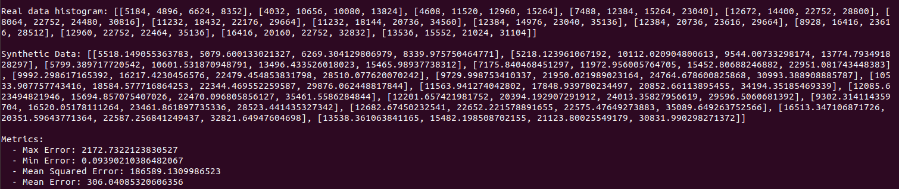

<div align="center">
    
    
</div>


## 七、结果分析

1.无论是一维MWEM，还是二维MWEM，可发现如下结论：

- 随着隐私运算值eps增大，各项误差呈现下降的趋势，即查询准确性越来越高。这是因为较大的eps表示对隐私的容忍度较高，即允许更多的真实信息泄露，因此查询结果更加准确。
- 反之，随着隐私运算值eps减小，各项误差呈现上升的趋势，即查询准确性越来越低。这是因为较小的eps对隐私的保护要求更严格，需要添加更多的噪声来混淆真实数据，因此保护隐私更好，所以查询结果的准确性降低。

2.我们实现的二维MWEM，当隐私运算值eps=1，5，10时，各项误差差距不大。

3.直方图的横坐标是数据值，纵坐标是频数，可以看出，我们实现的MWEM一维算法生成的合成数据与原始数据差异不大，隐私保护较强。

4.数据染色图的横纵坐标代表数据点，颜色代表频数，颜色越深即数据点越多，可以看出，我们实现的MWEM二维算法生成的合成数据与原始数据差异也不大，隐私保护也较强。

5.在实验中发现，由于二维MWEM查询集是一个字典集，所以重选查询的次数比一维要多。


## 八、实验总结

本次实验通过实现和评估MWEM算法，探讨其在差分隐私数据发布中的应用。实验结果表明，MWEM算法能够在保护隐私的同时提供较为准确的查询结果。较大的隐私预算值下查询准确性较高，而较小的隐私预算值则隐私保护更强。

MWEM算法在差分隐私数据发布中表现出色，但需在隐私保护和数据准确性之间进行权衡。希望未来可以进一步优化算法参数和策略，扩展应用范围，评估其在真实环境下的表现。

本次实验具有一定的挑战性，我们小组进行了差分隐私的整体学习，并战胜了许多出乎意料的bug，为了结果的达标，进行了多种的尝试，虽然过程有些曲折，但对MWEM算法也有了更深入的理解。这个可能是我们本科生涯最后一个代码实现的大作业，也是尽力而为，希望不留遗憾！